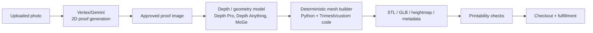

# AI 3D Model Generation Research for 3D Print Posters

Date: 2026-05-06

## Executive Summary

The model-building part of this product should live in `services/print-file-generator`, but the best first production path is probably not a full "single image to 360-degree 3D object" model.

For a 5in x 7in printable poster relief, we need a controlled bas-relief surface: fixed dimensions, known base thickness, bounded relief depth, watertight STL/GLB output, and printability checks. Current general image-to-3D asset models are exciting, but they are mostly designed for game/AR assets, not for physically reliable poster reliefs.

Recommended MVP path:

1. Use Vertex/Gemini to create or refine the 2D poster proof.
2. Use a depth/geometry model such as Depth Anything V2, Apple Depth Pro, or Microsoft MoGe-2 to create a depth map from the approved proof.
3. Use deterministic Python geometry code in `services/print-file-generator` to convert that depth map into STL/GLB/heightmap/metadata.
4. Add optional experiments with full image-to-3D models like TRELLIS, SAM 3D Objects, Hunyuan3D, Stable Fast 3D, or TripoSR only after the heightmap relief pipeline works.

In plain English: AI should help us understand the image's depth, but our own service should be the part that makes the final printable object.

## What We Actually Need

This project is not trying to generate an arbitrary toy, chair, shoe, or game prop. It is trying to generate a printable poster relief.

That means the output needs:

- A fixed 5in x 7in footprint, currently 127mm x 177.8mm.
- A controlled relief range, currently about 0.4mm to 3.0mm.
- A base plate, currently about 1.2mm.
- A watertight mesh suitable for slicing.
- Smooth enough geometry to print, without noisy spikes.
- An optional color package for full-color printing.
- An optional filament-painting package for FDM printing.
- Metadata proving which input, proof, settings, model, and artifact files were used.

General AI 3D asset generators can make impressive objects, but they do not automatically satisfy those manufacturing constraints.

## Recommended Architecture

This keeps the creative AI step separate from the manufacturing step. That is good for debugging, cost control, print quality, and customer support.

## Strongest Candidates

### Depth / Relief Models

These are the best fit for our poster-relief product because they create depth maps or geometry cues that can be converted into a controlled bas-relief.

| Candidate | What It Does | Fit For Us | Notes |
| --- | --- | --- | --- |
| [Depth Anything V2](https://github.com/DepthAnything/Depth-Anything-V2) | Monocular depth estimation from a single image. | High | Strong first candidate. The repo says V2 improves fine details and robustness and has small/base/large checkpoints. Important license detail: Small is Apache-2.0; Base/Large/Giant are CC-BY-NC-4.0, so commercial use needs care. |
| [Apple Depth Pro](https://github.com/apple/ml-depth-pro) | Sharp metric depth from a single image, including fine boundaries and focal-length estimation. | High | Very promising for clean relief boundaries. Apple reports a 2.25MP depth map in 0.3s on a standard GPU. Custom Apple license, so review before production. |
| [Microsoft MoGe / MoGe-2](https://github.com/microsoft/MoGe) | Monocular geometry: point maps, metric depth, normal maps, and camera FOV. | High | Excellent research fit because it can output depth and normals. MoGe code is MIT except DINOv2 subcode under Apache-2.0. Good prototype candidate for better relief surfaces. |
| [Marigold](https://github.com/prs-eth/Marigold) | Diffusion-based monocular depth estimation and dense image analysis. | Medium | Good quality research option, but likely slower/heavier than Depth Anything V2 for production. Better as an evaluation baseline than the first production path. |

### Image-to-3D Asset Models

These can generate full 3D assets from one image or a prompt. They are interesting, but they are not automatically print-ready relief generators.

| Candidate | What It Does | Fit For Us | Notes |
| --- | --- | --- | --- |
| [Microsoft TRELLIS](https://github.com/microsoft/TRELLIS) | Generates 3D assets from text or images in formats including meshes, 3D Gaussians, and radiance fields. | Medium | Very strong open-source option. MIT license for models and most code. Better for optional "full object" experiments than MVP relief generation. |
| [Meta SAM 3D Objects](https://github.com/facebookresearch/sam-3d-objects) | Reconstructs full 3D object shape, texture, and layout from a single image/mask. | Medium | New and powerful. Useful if we want subject extraction and raised object effects. Uses a custom SAM license, so review before production. |
| [Tencent Hunyuan3D 2.1](https://github.com/Tencent-Hunyuan/Hunyuan3D-2.1) | Image-to-shape plus PBR texture generation. | Medium | High visual quality, but heavier. Repo notes about 10GB VRAM for shape, 21GB for texture, 29GB for shape+texture total. License has territory exclusions and commercial terms, so treat as research until cleared. |
| [Hunyuan3D 2 / 2.5](https://github.com/Tencent-Hunyuan/Hunyuan3D-2) | High-resolution textured 3D assets; 2.5 paper describes up to 10B parameter models. | Medium | Impressive, but the open-source/commercial story is not as simple as MIT projects. Not the first production choice for a small poster-relief MVP. |
| [Stable Fast 3D](https://github.com/Stability-AI/stable-fast-3d) | Fast single-image mesh reconstruction with GLB export, UV unwrapping, and material prediction. | Medium | Practical prototype option. Default run needs about 6GB VRAM. Stability community license allows limited commercial use but has revenue/registration terms. |
| [TripoSR](https://github.com/VAST-AI-Research/TripoSR) | Fast feed-forward 3D reconstruction from a single image. | Medium-low | MIT licensed and fast, but older/lower fidelity than newer options. Useful as a lightweight baseline. |
| [PartCrafter](https://github.com/wgsxm/PartCrafter) | Generates structured, separate 3D part meshes from a single image. | Low-medium | Interesting for future product variants or part-aware editing, less directly relevant to a flat poster relief. |
| [Roblox Cube 3D](https://github.com/Roblox/cube) | Text-to-shape mesh generation and 3D tokenization. | Low | More game/object oriented and text-to-shape focused. Not a natural fit for turning a user's approved proof into a 5x7 relief. |

### Geometry / Mesh Libraries

These are the tools most likely to become production code in `services/print-file-generator`.

| Candidate | What It Does | Fit For Us | Notes |
| --- | --- | --- | --- |
| [Trimesh](https://github.com/mikedh/trimesh) | Python mesh loading, processing, exporting, with emphasis on watertight surfaces. | Very high | Best first library for STL/GLB export, bounds checks, mesh validation, and basic repair. Pin a version before production. |
| [Heightmap2STL](https://github.com/41pha1/Heightmap2STL) | Converts heightmaps to STL, with dynamic subdivision. | Medium | Useful reference, especially for adaptive vertex density. We should probably implement our own controlled version rather than copy it wholesale. |
| [lithophane on PyPI](https://pypi.org/project/lithophane/) | Converts images into lithophane STL models. | Medium | Good reference for image-to-STL workflows, but our product is front-lit bas-relief/full-color poster relief, not a translucent lithophane. |
| [LithoMaker](https://github.com/muldjord/lithomaker) | Local open-source lithophane generator. | Medium | Useful UX and mesh-generation reference for printable image reliefs. |
| [Impressa](https://impressa.tech/) | Open-source image-to-lithophane STL web app with smoothing, base thickness, and closed STL generation. | Medium | Very close in spirit to our first deterministic pipeline, though it targets lithophanes rather than styled relief posters. |

## Best Path For This Project

### Phase 1: Deterministic Relief MVP

Build this first inside `services/print-file-generator`.

Inputs:

- `approvedImagePath`
- target width and height
- min/max relief depth
- base thickness
- crop/pad strategy

Processing:

1. Fetch approved image from Cloud Storage.
2. Normalize orientation and crop/pad to 5:7.
3. Generate a depth map with one model:
   - first test: Depth Anything V2 Small or Apple Depth Pro
   - second test: MoGe-2 with normals if the relief needs better surface shape
4. Smooth and clamp the depth map.
5. Convert depth map to a bas-relief heightmap.
6. Generate a watertight STL with sidewalls and base.
7. Generate GLB preview.
8. Save `heightmap.png`, `model.stl`, `preview.glb`, and `metadata.json`.
9. Return printability metadata.

Why this is the best first step:

- It matches the product: a poster relief, not a free-standing object.
- It is explainable and adjustable.
- It can be tested with known fixtures.
- It gives us exact control over dimensions and depth.
- It does not require a huge GPU for every order if we pick the right depth model or host depth inference separately.

### Phase 2: AI-Assisted Subject Relief

Once the basic relief works, add smarter composition:

- Segment subject/background.
- Raise the subject slightly more than the background.
- Preserve faces with softer relief.
- Reduce micro-detail noise in hair, fabric, and backgrounds.
- Generate normal maps as well as depth maps.

Good candidates:

- MoGe-2 for depth + normal maps.
- SAM-style segmentation for subject masks.
- Vertex/Gemini for QA descriptions and prompt-based proof refinement.

### Phase 3: Optional Full 3D Asset Experiment

Only after the bas-relief path works, run a side-by-side experiment:

- TRELLIS
- SAM 3D Objects
- Hunyuan3D 2.1
- Stable Fast 3D
- TripoSR

Test them against our real product constraints:

- Can we flatten or project their output into a 5x7 relief?
- Is the mesh watertight?
- Does it preserve recognizable customer faces without weird geometry?
- Does it create unsupported tiny features?
- How expensive is inference?
- What are the license obligations?
- Does the output slice cleanly?

My expectation: these models may help create hero-object variants, but they will not replace the deterministic relief pipeline for the first sellable product.

## Recommended Shortlist To Prototype

1. **Depth Anything V2 Small + Trimesh**
   - Best low-risk first prototype.
   - Apache-2.0 for the Small model.
   - Good enough to prove the full image-to-STL pipeline.

2. **Apple Depth Pro + Trimesh**
   - Best candidate for sharper portrait edges and clean relief boundaries.
   - Review license before production.

3. **MoGe-2 + Trimesh**
   - Best candidate if normals and metric geometry produce better relief quality.
   - Good for second prototype after a simple depth-map path exists.

4. **TRELLIS side experiment**
   - Best open-source full 3D asset generator to test because of MIT licensing and strong capabilities.
   - Keep this outside the core checkout path until proven print-safe.

5. **SAM 3D Objects side experiment**
   - Best candidate for object-aware reconstruction from cluttered real images.
   - Review SAM license and output format constraints before production.

## Product Decision

For this product, "Vertex creates the 3D model" should probably become:

> Vertex creates or improves the 2D customer proof. A depth/geometry model estimates image structure. Our Cloud Run print-file generator creates the actual printable 3D model.

That gives us the best balance of creativity, control, cost, and printability.

## Risks

- Monocular depth models guess depth. They do not know the true 3D shape of a person or object.
- Faces can look strange if depth is mapped too aggressively.
- AI-generated images can contain tiny texture noise that becomes unprintable surface noise.
- Full image-to-3D asset models often create game-style assets, not manufacturing-ready models.
- Licenses vary a lot. Hunyuan, Stability, SAM, and some Depth Anything checkpoints need legal review before production use.
- GPU inference costs can change the unit economics of a $60 physical product.
- Full-color 3D printing requires partner-approved formats and color workflow; STL alone is not enough.

## Sources

- [Depth Anything V2 GitHub](https://github.com/DepthAnything/Depth-Anything-V2)
- [Depth Anything V2 paper](https://arxiv.org/abs/2406.09414)
- [Apple Depth Pro GitHub](https://github.com/apple/ml-depth-pro)
- [Apple Depth Pro paper](https://arxiv.org/abs/2410.02073)
- [Microsoft MoGe GitHub](https://github.com/microsoft/MoGe)
- [MoGe paper](https://arxiv.org/abs/2410.19115)
- [MoGe-2 paper](https://arxiv.org/abs/2507.02546)
- [Marigold GitHub](https://github.com/prs-eth/marigold)
- [Microsoft TRELLIS GitHub](https://github.com/microsoft/TRELLIS)
- [TRELLIS CVPR 2025 paper](https://openaccess.thecvf.com/content/CVPR2025/papers/Xiang_Structured_3D_Latents_for_Scalable_and_Versatile_3D_Generation_CVPR_2025_paper.pdf)
- [Meta SAM 3D Objects GitHub](https://github.com/facebookresearch/sam-3d-objects)
- [Meta SAM 3D blog](https://ai.meta.com/blog/sam-3d/)
- [SAM 3D paper](https://arxiv.org/abs/2511.16624)
- [Tencent Hunyuan3D 2.1 GitHub](https://github.com/Tencent-Hunyuan/Hunyuan3D-2.1)
- [Hunyuan3D 2.1 paper](https://arxiv.org/abs/2506.15442)
- [Hunyuan3D 2.5 paper](https://arxiv.org/abs/2506.16504)
- [Stable Fast 3D GitHub](https://github.com/Stability-AI/stable-fast-3d)
- [Stable Fast 3D announcement](https://stability.ai/news/introducing-stable-fast-3d)
- [TripoSR GitHub](https://github.com/VAST-AI-Research/TripoSR)
- [TripoSR paper](https://arxiv.org/abs/2403.02151)
- [PartCrafter GitHub](https://github.com/wgsxm/PartCrafter)
- [PartCrafter paper](https://arxiv.org/abs/2506.05573)
- [Roblox Cube GitHub](https://github.com/Roblox/cube)
- [Roblox Cube announcement](https://corp.roblox.com/newsroom/2025/03/introducing-roblox-cube)
- [Trimesh GitHub](https://github.com/mikedh/trimesh)
- [Heightmap2STL GitHub](https://github.com/41pha1/Heightmap2STL)
- [lithophane PyPI](https://pypi.org/project/lithophane/)
- [LithoMaker GitHub](https://github.com/muldjord/lithomaker)
- [Impressa](https://impressa.tech/)
