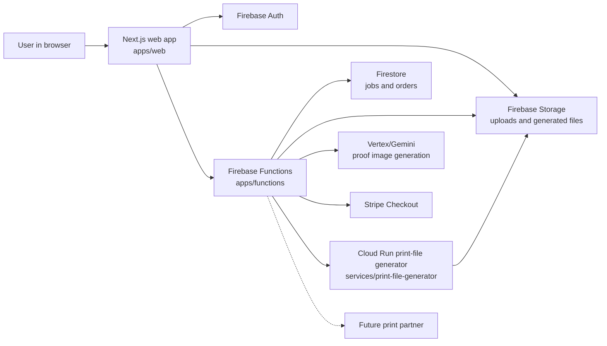
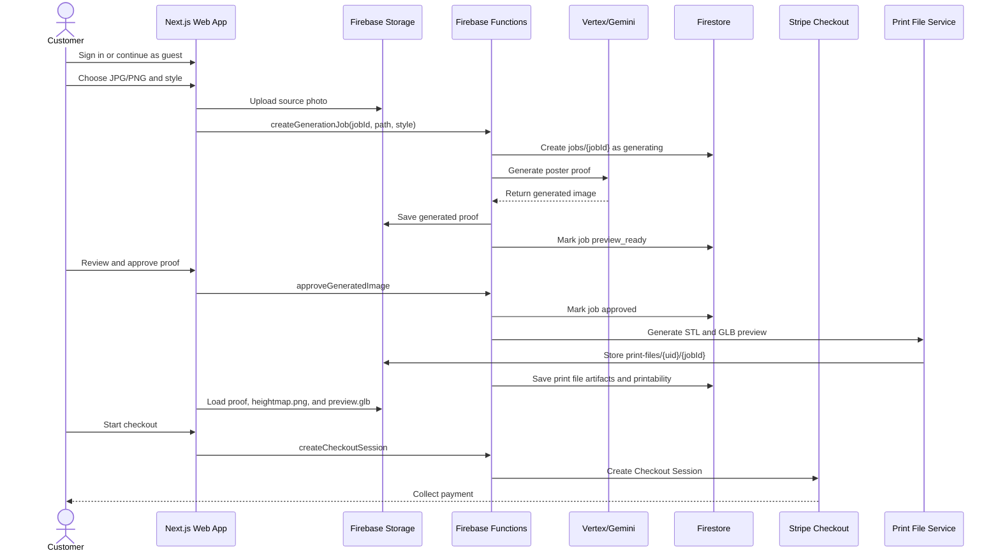
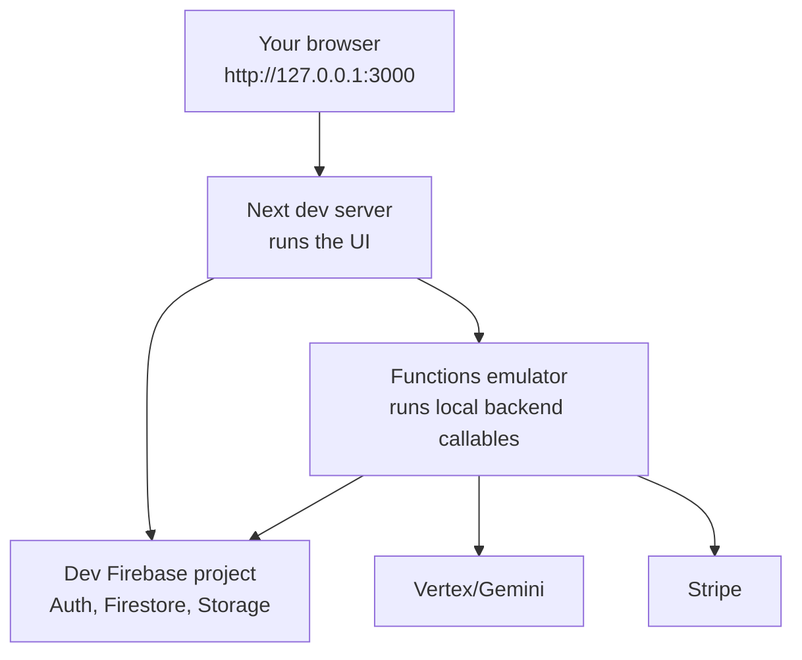

# 3D Print Posters

3D Print Posters is a mobile-first web app for turning a user photo into a stylized 5in x 7in 3D-printable poster relief. The current MVP lets a user sign in, upload a photo, choose a style, ask the backend to generate a proof image, approve that proof, and start Stripe Checkout.

This project is still in local MVP development. It is not production-ready yet.

## Where We Are Now

Working now:

- Next.js customer app in `apps/web`
- Firebase Auth sign-in, including guest sessions
- Browser upload to Firebase Storage
- Firebase callable Functions for job creation, proof approval, print-file generation orchestration, and checkout
- Direct Vertex/Gemini proof-generation adapter in `apps/functions`
- Python print-file generator service for baseline STL, GLB preview, heightmap, metadata, and printability output
- Job-page proof, heightmap, and 3D GLB inspection view after proof approval
- Firestore and Storage security rules for the dev Firebase project
- Stripe Checkout session creation boundary
- PWA manifest, icons, and install behavior
- Local Next.js testing at `http://127.0.0.1:3000`
- Function-only Firebase emulator testing at `http://127.0.0.1:5001`
- Full Firebase emulator testing for Auth, Functions, Firestore, and Storage

Not done yet:

- Deployed Cloud Run print-file generator endpoint
- Fulfillment partner integration
- Production Firebase projects
- Public App Hosting deployment
- Production monitoring, quotas, moderation, and cleanup jobs

## The Big Picture

Think of this app as three cooperating pieces:

- The web app is what the customer sees and clicks.
- Firebase Functions are the trusted backend. They check ownership, call AI, create jobs, orchestrate print-file generation, and talk to Stripe.
- The print-file generator is a Python service that turns an approved image into printable artifacts like STL, heightmap, preview GLB, metadata, and later color packages.



## Customer Flow

This is the intended happy path for one poster order.



The home-page 3D panel is still a visual preview shell. The job page shows the approved proof, generated `heightmap.png`, and real `preview.glb` side by side after the user approves the proof and the print-file generator finishes.

## Why There Is A Dev Server And A Functions Emulator

During local development, you often run two servers:



The Next dev server runs the website. The Functions emulator runs backend functions without deploying them. In the common hybrid setup, Auth, Firestore, and Storage still use the real dev Firebase project, while callable Functions run locally.

This is useful because you can edit backend code, restart the emulator, and test without waiting for a Firebase deploy.

## Repository Map

```text
apps/web                    Customer-facing Next.js app
apps/functions              Firebase Functions backend
services/print-file-generator Planned Python print artifact service
services/stl-converter      Older STL-only service scaffold
infra/firebase              Firestore and Storage rules
infra/cloudflare            Domain and DNS notes
docs                        Architecture, deployment, and workflow docs
scripts                     Helper scripts
```

Start with these files when you feel lost:

- `README.md`: practical beginner map
- `CHECKLIST.md`: implementation checklist
- `CHANGELOG.md`: what changed recently
- `docs/ARCHITECTURE.md`: deeper system design
- `docs/DEPLOYMENT.md`: hosting, Firebase, Cloudflare, and secret notes
- `docs/PRINT_FILE_GENERATOR_ARCHITECTURE_ROADMAP_EVALUATION.md`: accepted print-file generator integration plan
- `AI_3D_MODEL_GENERATION_RESEARCH.md`: AI depth and image-to-3D research behind that plan

## Print-File Generator Direction

The next major implementation slice is the print-file generator. We accepted the extraction path:

- Keep `services/print-file-generator` as the FastAPI/Cloud Run service boundary.
- Selectively port core image, heightmap, STL, metadata, color, and test ideas from `E:\PROJECTS\print-file-generator`.
- Do not copy the standalone Flask app, SQLite project database, browser session state, CLI control plane, or TD1 hardware code into the production service.
- First build deterministic 5in x 7in relief generation: validated image input, 5:7 crop/pad, heightmap, closed watertight mesh with base and sidewalls, binary STL, heightmap PNG, metadata, and printability checks.
- Add Depth Anything V2 Small, Depth Pro, MoGe, or other AI depth providers only after the deterministic relief pipeline works.

See `docs/PRINT_FILE_GENERATOR_ARCHITECTURE_ROADMAP_EVALUATION.md` for the phased roadmap.

## Setup

Install dependencies from the repo root:

```powershell
npm install
```

The project expects Node.js 22 or newer.

Create local web config at:

```text
apps/web/.env.local
```

Required public browser values:

```text
NEXT_PUBLIC_FIREBASE_API_KEY=
NEXT_PUBLIC_FIREBASE_AUTH_DOMAIN=
NEXT_PUBLIC_FIREBASE_PROJECT_ID=
NEXT_PUBLIC_FIREBASE_STORAGE_BUCKET=
NEXT_PUBLIC_FIREBASE_MESSAGING_SENDER_ID=
NEXT_PUBLIC_FIREBASE_APP_ID=
NEXT_PUBLIC_USE_FIREBASE_EMULATORS=false
NEXT_PUBLIC_USE_FIREBASE_FUNCTIONS_EMULATOR=true
PUBLIC_APP_URL=http://localhost:3000
```

For local Functions emulator runs, create:

```text
apps/functions/.env
```

Server-only values for local backend testing go there:

```text
VERTEX_API_KEY=
AI_PROVIDER_ROUTE=vertex-gemini-direct
VERTEX_IMAGE_MODEL=gemini-2.5-flash-image
STRIPE_SECRET_KEY=
STRIPE_WEBHOOK_SECRET=
STRIPE_POSTER_PRICE_ID=
PUBLIC_APP_URL=http://localhost:3000
APP_STORAGE_BUCKET=gen-lang-client-0675309660.firebasestorage.app
PRINT_FILE_GENERATOR_URL=http://127.0.0.1:8089
```

Do not commit real `.env` files or secrets.

## Local Testing: Hybrid Mode

This is the easiest useful end-to-end test mode right now.

In terminal 1, start the print-file generator:

```powershell
cd services/print-file-generator
uvicorn app.main:app --reload --port 8089
```

In terminal 2, start the Functions emulator:

```powershell
npm run firebase:emulators:functions
```

In terminal 3, start the web app:

```powershell
npm run dev
```

Open:

```text
http://127.0.0.1:3000
```

Make sure `apps/web/.env.local` has:

```text
NEXT_PUBLIC_USE_FIREBASE_EMULATORS=false
NEXT_PUBLIC_USE_FIREBASE_FUNCTIONS_EMULATOR=true
```

In this mode:

- Auth uses the real dev Firebase project.
- Storage uses the real dev Firebase project.
- Firestore uses the real dev Firebase project.
- Callable Functions use your local emulator.
- Vertex/Gemini generation is live when `AI_PROVIDER_ROUTE=vertex-gemini-direct`.
- Print-file generation calls `PRINT_FILE_GENERATOR_URL` and writes artifacts under `print-files/{uid}/{jobId}`.

If generation fails with `Poster generation failed before a proof was ready`, check `apps/functions/.env` first. The local Functions emulator needs `VERTEX_API_KEY` before it can call Vertex/Gemini.

If approval fails with `3D preview generation failed`, make sure the print-file generator is running on `http://127.0.0.1:8089` and that `apps/functions/.env` has `PRINT_FILE_GENERATOR_URL=http://127.0.0.1:8089`. The print-file generator accepts generated proof images up to 4,000,000 decoded pixels by default before resizing them to the working relief resolution.

## Local Testing: Web Only

Use this when you only want to inspect UI layout and pages:

```powershell
npm run dev
```

Then open:

```text
http://127.0.0.1:3000
```

This does not prove backend generation, checkout, or database flows by itself.

## Local Testing: Full Firebase Emulator

The full emulator suite runs Auth, Functions, Firestore, and Storage locally.

```powershell
npm run firebase:emulators:full
```

Set this in `apps/web/.env.local`:

```text
NEXT_PUBLIC_USE_FIREBASE_EMULATORS=true
NEXT_PUBLIC_USE_FIREBASE_FUNCTIONS_EMULATOR=true
```

This mode requires JDK 21+. On this machine, Microsoft OpenJDK 21 is installed, new terminals resolve `java -version` to Java 21, and the checked-in preflight passes.

## Basic Manual Test Checklist

Use this checklist when testing the app as a beginner.

- [ ] Run `npm install` if dependencies are missing.
- [ ] Confirm `apps/web/.env.local` exists.
- [ ] Confirm `apps/functions/.env` exists if using the Functions emulator.
- [ ] Start `npm run firebase:emulators:functions`.
- [ ] Start `npm run dev`.
- [ ] Open `http://127.0.0.1:3000`.
- [ ] Sign in or continue as guest.
- [ ] Upload a JPG or PNG.
- [ ] Pick a style.
- [ ] Click Generate.
- [ ] Confirm the image uploads successfully.
- [ ] Confirm a job document appears in Firestore.
- [ ] Confirm a generated proof image appears in Storage.
- [ ] Confirm the app navigates to `/jobs/{jobId}`.
- [ ] Approve the proof.
- [ ] Confirm the job page shows the approved proof, generated heightmap, 3D preview, warning details, and artifact downloads.
- [ ] Start checkout.
- [ ] Confirm a Stripe Checkout Session is created.
- [ ] Confirm an order document appears in Firestore.

## Developer Checks

Run TypeScript checks:

```powershell
npm run typecheck
```

Build the Next.js app:

```powershell
npm run build
```

Dry-run Firebase rules:

```powershell
npm run firebase:deploy:firestore-rules:dry-run
npm run firebase:deploy:storage-rules:dry-run
npm run firebase:deploy:rules:dry-run
```

Deploy dev Firebase rules intentionally:

```powershell
npm run firebase:deploy:rules:dev
```

Apply dev Storage CORS intentionally:

```powershell
npm run firebase:deploy:storage-cors:dev
```

## Common Problems

### The app says generation failed before a proof was ready

Most likely causes:

- `apps/functions/.env` is missing `VERTEX_API_KEY`.
- The Functions emulator was not restarted after adding env values.
- The uploaded file is too large for the configured Vertex inline image limit.
- Vertex/Gemini rejected or failed the image-generation request.
- The function cannot read from or write to the configured Firebase Storage bucket.

### I see both localhost 3000 and 5001

That is expected in hybrid local testing.

- `3000` is the web app.
- `5001` is the Functions emulator.

### The home-page preview shows a flat plate

That is expected on the upload screen. The real generated 3D preview appears with the approved proof and heightmap on `/jobs/{jobId}` after proof approval and print-file generation.

If the job page does not show a 3D preview after approval, check that the print-file generator is running, `PRINT_FILE_GENERATOR_URL` is configured, Storage rules allow reads under `print-files/{uid}/{jobId}`, Storage CORS allows `http://localhost:3000`, and the approved proof image is not above the generator's decoded pixel limit.

If the 3D preview was generated before a relief-algorithm change, use **Regenerate 3D preview** on the approved proof to rebuild `preview.glb`, `model.stl`, `heightmap.png`, and `metadata.json` for that job.

### Checkout should not be live yet

Use Stripe test mode until payment, webhook, and fulfillment state transitions are proven end to end. Rotate any exposed live keys before production work continues.

## Production Readiness Checklist

### Firebase and Hosting

- [ ] Create dedicated staging Firebase/GCP project.
- [ ] Create dedicated production Firebase/GCP project.
- [ ] Add `staging` and `production` aliases to `.firebaserc`.
- [ ] Enable Firebase Auth in staging and production.
- [ ] Enable Email/Password sign-in.
- [ ] Decide whether Anonymous sign-in is allowed publicly.
- [ ] Enable Firestore.
- [ ] Enable Cloud Storage.
- [ ] Deploy Firestore and Storage rules to staging.
- [ ] Deploy Firestore and Storage rules to production.
- [ ] Create Firebase App Hosting backend for `apps/web` staging.
- [ ] Create Firebase App Hosting backend for `apps/web` production.
- [ ] Configure public Firebase web env values for each App Hosting backend.
- [ ] Point `staging.3dprintposters.com` to staging App Hosting.
- [ ] Point `www.3dprintposters.com` to production App Hosting.
- [ ] Configure apex `3dprintposters.com` redirect or flattening.

### Backend and AI

- [ ] Store `VERTEX_API_KEY` as a Firebase Functions secret.
- [ ] Confirm production model and `VERTEX_IMAGE_MODEL`.
- [ ] Add moderation and safety review for uploads and generated content.
- [ ] Add user quotas and abuse controls.
- [ ] Add cost caps and alerts for AI usage.
- [ ] Add structured logs for job state changes.
- [ ] Add retry behavior or queueing with Cloud Tasks/Pub/Sub.
- [ ] Add idempotency keys for fulfillment side effects.

### Print Files

- [x] Keep `services/print-file-generator` as the FastAPI/Cloud Run boundary.
- [x] Extract core image, heightmap, STL, metadata, color, and tests from `E:\PROJECTS\print-file-generator` without vendoring its Flask/SQLite app shell.
- [x] Implement image validation and normalization.
- [x] Add 5:7 crop/pad handling.
- [x] Generate deterministic luminance heightmaps.
- [x] Generate a closed watertight 5in x 7in relief mesh with base and sidewalls.
- [x] Generate binary STL files from the closed relief mesh.
- [x] Generate `heightmap.png` and `metadata.json`.
- [x] Generate browser preview mesh as GLB.
- [x] Store the exact artifact manifest used for checkout.
- [x] Add known-image test fixtures.
- [ ] Deploy the print-file generator as a Cloud Run service and set production `PRINT_FILE_GENERATOR_URL`.
- [ ] Generate full-color package artifacts such as 3MF or OBJ plus texture.
- [ ] Generate filament painting files: palette, layer swaps, settings, preview.
- [x] Add printability checks for thickness, relief depth, dimensions, and file size.
- [ ] Add depth-model adapters after the deterministic relief pipeline passes fixture tests.

### Stripe and Fulfillment

- [ ] Rotate exposed live Stripe keys before launch work continues.
- [ ] Use Stripe test mode until the whole flow is proven.
- [ ] Configure Stripe webhook secret in staging.
- [ ] Configure Stripe webhook secret in production.
- [ ] Handle `checkout.session.completed`.
- [ ] Handle `checkout.session.expired`.
- [ ] Handle payment failure states.
- [ ] Persist Stripe customer ids.
- [ ] Choose a print partner.
- [ ] Confirm accepted file formats, dimensions, material profile, and quote process.
- [ ] Build fulfillment quote flow.
- [ ] Send paid orders to fulfillment only after confirmed payment.
- [ ] Add admin retry/manual-review states.

### Launch Basics

- [ ] Add privacy policy.
- [ ] Add terms of service.
- [ ] Add analytics events for upload, generation, approval, checkout, and purchase.
- [ ] Add error monitoring.
- [ ] Add Cloud Storage lifecycle cleanup for abandoned uploads.
- [ ] Add admin visibility for failed jobs and payment mismatches.
- [ ] Resolve or document dependency audit advisories.
- [ ] Run a full staging test with test cards.
- [ ] Run a production smoke test with tightly controlled access.

## Current MVP Boundary

The current project proves the customer-facing order shape, live Vertex/Gemini proof generation, server-side print-file generation, GLB preview, and checkout gating on generated artifacts.

The next major unlock is productionizing that path: deploy the print-file generator to Cloud Run, add queueing/retries, create full-color partner packages, and connect a fulfillment workflow.
