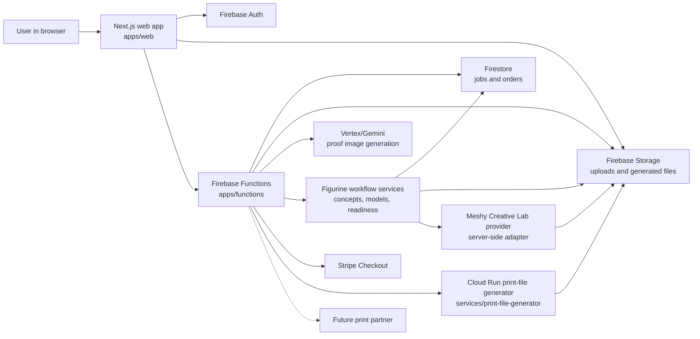
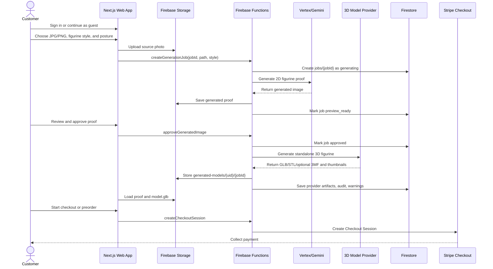
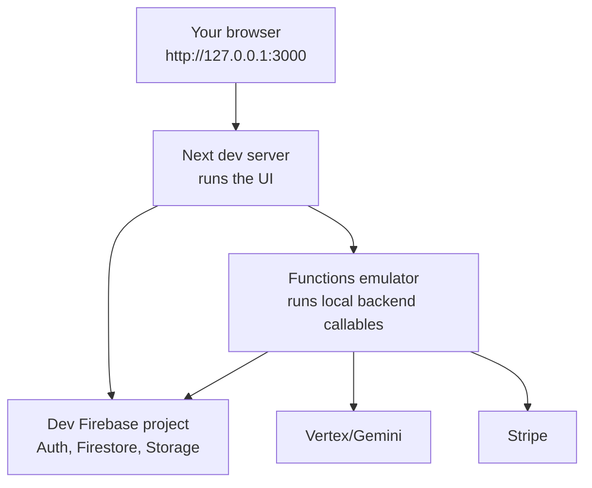

# 3D Print Posters

3D Print Posters is a mobile-first web app for personalized AI print products. As of 2026-05-23, the active business priority is no longer perfecting the 5x7 poster-relief generator first; it is proving demand with a PrintU-like customer flow for personalized figurines. The target MVP lets a user upload a photo, choose a figurine style and posture, approve a 2D proof, review a generated 3D figurine, and either check out or enter a preorder/manual-fulfillment funnel.

The existing poster-relief path still works as R&D: it turns controlled stylized art into a 5in x 7in relief window inside a 5.5in x 7.5in physical object. The Super Dad proof remains the north star if that line resumes, but relief quality is not the next customer-acquisition blocker. `3dprintyou.com` is the better-fit public domain candidate for the figurine pivot; `3dprintposters.com` can stay attached to the parked poster-relief line or become a redirect later.

This project is still in local MVP development. It is not production-ready yet.

## Where We Are Now

Working now:

- Next.js customer app in `apps/web`
- Firebase Auth sign-in, including guest sessions
- Browser upload to Firebase Storage
- Firebase callable Functions for job creation, proof approval, print-file generation orchestration, and checkout
- Direct Vertex/Gemini proof-generation adapter in `apps/functions`
- New product direction documented in `research/FIGURINE_PROVIDER_RESEARCH.md`: PrintU-like figurine workflow first, Meshy.ai as the first image-to-3D provider candidate, relief parked as R&D
- Local root `.env` has `MESHY_API_KEY` for a paid Meshy account; never print or commit the value
- Preview-only Meshy Creative Lab figurine workflow: proof approval can call the server-side Meshy provider adapter, store the original textured `model.glb` under `print-files/{uid}/{jobId}/figurine/creative-lab-original/`, show it on the job page, and keep checkout locked while `printReadiness` is `needs_review`
- First Meshy/base scale contract: job `f604d393-bfa2-4779-b05b-f6a2082604c9` established a matched raw GLB-scale square base under `.tmp/gold-standard/Figurine Standard Square Base/`; the target printable height is `150mm`, giving an expected base of about `105.24mm x 105.24mm x 24.00mm`
- Python print-file generator service for 400px mesh-output STL, 768px geometry-analysis depth/mask/detail work, geometry-only proof cleanup, contour-smoothed subject edges, HueForge-like lithophane subject height blending, reduced surface-intent smoothing, graphic emboss for text/logos, face-aware texture damping, face/forehead pit guarding, image-colored GLB preview, heightmap, metadata, full-color packages, filament painting guides, debug artifacts, region roughness metrics, and printability output
- Current relief-quality direction: surface-intent aware generation where `lithophane_baseline` drives more of the subject height signal, semantic depth controls broad shape/background separation, skin/scalp/neck/simple clothing/backgrounds stay controlled instead of over-smoothed, and text/logos/emblems/panel lines remain deliberate and inspectable
- Job-page proof, heightmap, 3D GLB inspection view, and local `.tmp` print-package mirroring after proof approval
- Firestore and Storage security rules for the dev Firebase project
- Stripe Checkout session creation boundary
- PWA manifest, icons, and install behavior
- Local Next.js testing at `http://127.0.0.1:3000`
- Function-only Firebase emulator testing at `http://127.0.0.1:5001`
- Full Firebase emulator testing for Auth, Functions, Firestore, and Storage
- Graphify knowledge-graph helper for AI developer navigation, with Gemini-backed refresh scripts and generated output ignored under `graphify-out/`

Not done yet:

- Customer-facing figurine style/posture flow
- Full customer-facing figurine style/posture controls beyond the current Creative Lab preview slice
- Richer figurine workflow backend services for 2D concept history, model history, retries, readiness, final body/base package state, and checkout eligibility
- Meshy webhook-to-Firestore reconciliation beyond the current submit/poll preview adapter
- Deterministic 150mm Meshy-body-to-square-base assembly, final STL/3MF package export, and print-readiness audit
- Slicer and physical-print validation for provider-generated figurines
- Deployed Cloud Run print-file generator endpoint
- Fulfillment partner integration
- Production Firebase projects
- Public App Hosting deployment
- Production monitoring, quotas, moderation, and cleanup jobs

## The Big Picture

Think of this app as four cooperating pieces:

- The web app is what the customer sees and clicks.
- Firebase Functions are the trusted backend. They check ownership, call AI, create jobs, orchestrate print-file generation, and talk to Stripe.
- The figurine workflow service layer will validate uploads, track style/posture, manage 2D concept history, submit selected concepts to generated-3D providers, ingest returned assets, and expose readiness/checkout state.
- The generated-3D provider layer will call Meshy or another image-to-3D service for standalone figurines and store returned GLB/STL/3MF assets.
- The print-file generator is a Python service that turns an approved image into poster-relief artifacts like STL, heightmap, image-colored preview GLB, metadata, full-color packages, and filament painting guides.



## Customer Flow

This is the new target happy path for one figurine order or preorder.



The implemented app now has a preview-only figurine branch after proof approval: Creative Lab Figure jobs can call Meshy server-side, store the original textured GLB in job-scoped Storage, render it on the job page, and keep checkout locked while print readiness is `needs_review`. Poster-relief jobs still use the older print-file generator path.

The home-page 3D panel is still a visual preview shell. In the existing relief path, the job page shows the approved proof, generated `heightmap.png`, and real color `preview.glb` after the user approves the proof and the print-file generator finishes. In the new figurine path, that page should review the standalone `model.glb`, provider thumbnails, generation warnings, and fulfillment/readiness state.

## Why There Is A Dev Server And A Functions Emulator

During local development, you often run two servers:



The Next dev server runs the website. The Functions emulator runs backend functions without deploying them. In the common hybrid setup, Auth, Firestore, and Storage still use the real dev Firebase project, while callable Functions run locally.

This is useful because you can edit backend code, restart the emulator, and test without waiting for a Firebase deploy.

## Repository Map

```text
apps/web                    Customer-facing Next.js app
apps/functions              Firebase Functions backend
services/print-file-generator Planned Python print artifact service
services/stl-converter      Older STL-only service scaffold
infra/firebase              Firestore and Storage rules
infra/cloudflare            Domain and DNS notes
docs                        Architecture, deployment, and workflow docs
scripts                     Helper scripts
```

Start with these files when you feel lost:

- `AGENTS.md`: operating rules for AI developers, including Graphify usage
- `DECISIONS.md`: durable product and architecture decisions
- `PROJECT_STATE.md`: compact current implementation state, active direction, and risks
- `README.md`: practical beginner map
- `CHECKLIST.md`: archive pointer and source-of-truth map
- `CHANGELOG.md`: what changed recently
- `docs/ARCHITECTURE.md`: deeper system design
- `docs/DEPLOYMENT.md`: hosting, Firebase, Cloudflare, and secret notes
- `docs/PRINT_FILE_GENERATION_WORKFLOW.md`: current print-file generator contract and product direction
- `research/FIGURINE_PROVIDER_RESEARCH.md`: current PrintU/Meshy pivot and provider research
- `research/HEIGHTMAP_AND_3D_WORKFLOW_RESEARCH.md`: historical AI depth and image-to-3D research behind the relief plan

## Figurine Direction

The next major implementation slice is the PrintU-like figurine customer flow:

- Keep the web-first PWA and Firebase backend.
- Let the customer upload a photo, choose a figurine style, and choose posture.
- Generate a 2D proof before spending credits on a 3D model.
- Create the service layer for the workflow: source validation, style/posture persistence, concept history/selection, model generation status/history, asset ingestion, readiness, editor options, and purchase-intent gating.
- Keep Meshy behind the server-side provider adapter and continue validating output quality, terms, cost, and retention before public checkout.
- Store generated GLB/STL/optional 3MF assets under user/job scoped Storage paths.
- Show the generated figurine in the job page before checkout or preorder.
- Validate slicer/print behavior before promising automated fulfillment.

See `docs/MESHY_FIGURINE_UI_WORKFLOW.md`, `research/FIGURINE_PROVIDER_RESEARCH.md`, and `docs/ROADMAP.md` for the current phased direction.

## Parked Print-File Generator Direction

The poster-relief generator is implemented R&D and can resume later. The accepted extraction path remains:

- Keep `services/print-file-generator` as the FastAPI/Cloud Run service boundary.
- Selectively port core image, heightmap, STL, metadata, color, and test ideas from `E:\PROJECTS\print-file-generator`.
- Do not copy the standalone Flask app, SQLite project database, browser session state, CLI control plane, or TD1 hardware code into the production service.
- Build relief generation around a 5in x 7in image window inside a 5.5in x 7.5in physical object: validated image input, 5:7 crop/pad, 768px geometry-analysis image, 400px mesh/color output heightmap, closed watertight mesh with base, sidewalls, shaped border/frame geometry, binary STL, heightmap PNG, metadata, debug artifacts, and printability checks.
- Treat the Super Dad generated proof as the near-term style target. The customer photo provides identity/reference, but the approved proof and a surface-intent policy should control manufacturing geometry. Smooth is the default unless a region is explicitly intended to be raised text, logo, panel line, hair, fabric, or another printable texture. The current hybrid path separates a cleaned graphic emboss mask from the general detail map and records region roughness metrics in `metadata.json`.
- Add Depth Anything V2 Small, Depth Pro, MoGe, or other AI depth providers only after the deterministic relief pipeline works.

See `docs/PRINT_FILE_GENERATION_WORKFLOW.md` for the parked poster-relief service contract.

## Setup

Install dependencies from the repo root:

```powershell
npm install
```

The project expects Node.js 22 or newer.

Create local web config at:

```text
apps/web/.env.local
```

Required public browser values:

```text
NEXT_PUBLIC_FIREBASE_API_KEY=
NEXT_PUBLIC_FIREBASE_AUTH_DOMAIN=
NEXT_PUBLIC_FIREBASE_PROJECT_ID=
NEXT_PUBLIC_FIREBASE_STORAGE_BUCKET=
NEXT_PUBLIC_FIREBASE_MESSAGING_SENDER_ID=
NEXT_PUBLIC_FIREBASE_APP_ID=
NEXT_PUBLIC_USE_FIREBASE_EMULATORS=false
NEXT_PUBLIC_USE_FIREBASE_FUNCTIONS_EMULATOR=true
PUBLIC_APP_URL=http://localhost:3000
```

For local Functions emulator runs, create:

```text
apps/functions/.env
apps/functions/.secret.local
```

Server-only values for local backend testing go there:

```text
AI_PROVIDER_ROUTE=vertex-gemini-direct
VERTEX_IMAGE_MODEL=gemini-3-pro-image
STRIPE_POSTER_PRICE_ID=
PUBLIC_APP_URL=http://localhost:3000
APP_STORAGE_BUCKET=gen-lang-client-0675309660.firebasestorage.app
PRINT_FILE_GENERATOR_URL=http://127.0.0.1:8089
MESHY_WEBHOOK_URL=
MESHY_WEBHOOK_SECRET=
```

Put Firebase Functions `defineSecret` values in ignored `apps/functions/.secret.local` for local emulator runs:

```text
VERTEX_API_KEY=
MESHY_API_KEY=
STRIPE_SECRET_KEY=
STRIPE_WEBHOOK_SECRET=
```

Do not commit real `.env` files or secrets.

## Local Testing: Hybrid Mode

This is the easiest useful end-to-end test mode right now.

In terminal 1, start the print-file generator:

```powershell
cd services/print-file-generator
uvicorn app.main:app --reload --port 8089
```

In terminal 2, start the Functions emulator:

```powershell
npm run firebase:emulators:functions
```

In terminal 3, start the web app:

```powershell
npm run dev
```

Open:

```text
http://127.0.0.1:3000
```

Make sure `apps/web/.env.local` has:

```text
NEXT_PUBLIC_USE_FIREBASE_EMULATORS=false
NEXT_PUBLIC_USE_FIREBASE_FUNCTIONS_EMULATOR=true
```

In this mode:

- Auth uses the real dev Firebase project.
- Storage uses the real dev Firebase project.
- Firestore uses the real dev Firebase project.
- Callable Functions use your local emulator.
- Vertex/Gemini generation is live when `AI_PROVIDER_ROUTE=vertex-gemini-direct`.
- Print-file generation calls `PRINT_FILE_GENERATOR_URL` and writes artifacts under `print-files/{uid}/{jobId}`.
- The Functions emulator mirrors generated print-file artifacts, including `debug/` relief-stage PNGs, to `.tmp/print-files/{uid}/{jobId}` for local inspection and later printer-owner handoff.

If generation fails with `Poster generation failed before a proof was ready`, check `apps/functions/.env` and `apps/functions/.secret.local` first. The local Functions emulator needs `VERTEX_API_KEY` before it can call Vertex/Gemini.

If approval fails with `3D preview generation failed`, make sure the print-file generator is running on `http://127.0.0.1:8089` and that `apps/functions/.env` has `PRINT_FILE_GENERATOR_URL=http://127.0.0.1:8089`. The print-file generator accepts generated proof images up to 4,000,000 decoded pixels by default before resizing them to the 768px geometry-analysis image and 400px mesh/color output. The approval callable and web client allow up to 9 minutes because the hybrid relief path can take longer than the default 60-second Functions timeout on first local runs. In local emulator runs, the job is marked `generated` before the optional `.tmp` artifact mirror finishes; if the app preview is ready but `.tmp/print-files/{uid}/{jobId}` is incomplete, wait for the Functions log line that the local mirror completed.

## Local Testing: Web Only

Use this when you only want to inspect UI layout and pages:

```powershell
npm run dev
```

Then open:

```text
http://127.0.0.1:3000
```

This does not prove backend generation, checkout, or database flows by itself.

## Local Testing: Full Firebase Emulator

The full emulator suite runs Auth, Functions, Firestore, and Storage locally.

```powershell
npm run firebase:emulators:full
```

Set this in `apps/web/.env.local`:

```text
NEXT_PUBLIC_USE_FIREBASE_EMULATORS=true
NEXT_PUBLIC_USE_FIREBASE_FUNCTIONS_EMULATOR=true
```

This mode requires JDK 21+. On this machine, Microsoft OpenJDK 21 is installed, new terminals resolve `java -version` to Java 21, and the checked-in preflight passes.

## Basic Manual Test Checklist

Use these steps when testing the implemented relief app as a beginner. The former root tracker has been archived; this manual relief flow remains here only for the existing relief product path.

- [ ] Run `npm install` if dependencies are missing.
- [ ] Confirm `apps/web/.env.local` exists.
- [ ] Confirm `apps/functions/.env` and `apps/functions/.secret.local` exist if using the Functions emulator.
- [ ] Start `npm run firebase:emulators:functions`.
- [ ] Start `npm run dev`.
- [ ] Open `http://127.0.0.1:3000`.
- [ ] Sign in or continue as guest.
- [ ] Upload a JPG or PNG.
- [ ] Pick a style.
- [ ] Click Generate.
- [ ] Confirm the image uploads successfully.
- [ ] Confirm a job document appears in Firestore.
- [ ] Confirm a generated proof image appears in Storage.
- [ ] Confirm the app navigates to `/jobs/{jobId}`.
- [ ] Approve the proof.
- [ ] Confirm the job page shows the approved proof, generated heightmap, 3D preview, warning details, and artifact downloads.
- [ ] Start checkout.
- [ ] Confirm a Stripe Checkout Session is created.
- [ ] Confirm an order document appears in Firestore.

## Developer Checks

Run TypeScript checks:

```powershell
npm run typecheck
```

Build the Next.js app:

```powershell
npm run build
```

Dry-run Firebase rules:

```powershell
npm run firebase:deploy:firestore-rules:dry-run
npm run firebase:deploy:storage-rules:dry-run
npm run firebase:deploy:rules:dry-run
```

Deploy dev Firebase rules intentionally:

```powershell
npm run firebase:deploy:rules:dev
```

Apply dev Storage CORS intentionally:

```powershell
npm run firebase:deploy:storage-cors:dev
```

## Common Problems

### The app says generation failed before a proof was ready

Most likely causes:

- `apps/functions/.secret.local` is missing `VERTEX_API_KEY`.
- The Functions emulator was not restarted after adding env values.
- The uploaded file is too large for the configured Vertex inline image limit.
- Vertex/Gemini rejected or failed the image-generation request.
- The function cannot read from or write to the configured Firebase Storage bucket.

### I see both localhost 3000 and 5001

That is expected in hybrid local testing.

- `3000` is the web app.
- `5001` is the Functions emulator.

### The home-page preview shows a flat plate

That is expected on the upload screen. The real generated 3D preview appears with the approved proof and heightmap on `/jobs/{jobId}` after proof approval and print-file generation.

If the job page does not show a 3D preview after approval, check that the print-file generator is running, `PRINT_FILE_GENERATOR_URL` is configured, Storage rules allow reads under `print-files/{uid}/{jobId}`, Storage CORS allows `http://localhost:3000`, and the approved proof image is not above the generator's decoded pixel limit.

If the 3D preview was generated before a relief-algorithm change, use **Regenerate 3D preview** on the approved proof to rebuild `preview.glb`, `model.stl`, `heightmap.png`, and `metadata.json` for that job.

### Checkout should not be live yet

Use Stripe test mode until payment, webhook, and fulfillment state transitions are proven end to end. Rotate any exposed live keys before production work continues.

## Production Readiness Checklist

### Firebase and Hosting

- [ ] Create dedicated staging Firebase/GCP project.
- [ ] Create dedicated production Firebase/GCP project.
- [ ] Add `staging` and `production` aliases to `.firebaserc`.
- [ ] Enable Firebase Auth in staging and production.
- [ ] Enable Email/Password sign-in.
- [ ] Decide whether Anonymous sign-in is allowed publicly.
- [ ] Enable Firestore.
- [ ] Enable Cloud Storage.
- [ ] Deploy Firestore and Storage rules to staging.
- [ ] Deploy Firestore and Storage rules to production.
- [ ] Create Firebase App Hosting backend for `apps/web` staging.
- [ ] Create Firebase App Hosting backend for `apps/web` production.
- [ ] Configure public Firebase web env values for each App Hosting backend.
- [ ] Point a staging hostname such as `staging.3dprintyou.com` to staging App Hosting.
- [ ] Point `www.3dprintyou.com` to production App Hosting.
- [ ] Configure apex `3dprintyou.com` redirect or flattening.
- [ ] Decide whether `3dprintposters.com` remains a separate poster-relief domain or redirects into the new offer.

### Backend and AI

- [ ] Store `VERTEX_API_KEY` as a Firebase Functions secret.
- [ ] Confirm production model and `VERTEX_IMAGE_MODEL`.
- [ ] Add moderation and safety review for uploads and generated content.
- [ ] Add user quotas and abuse controls.
- [ ] Add cost caps and alerts for AI usage.
- [ ] Add structured logs for job state changes.
- [ ] Add retry behavior or queueing with Cloud Tasks/Pub/Sub.
- [ ] Add idempotency keys for fulfillment side effects.

### Print Files

- [x] Keep `services/print-file-generator` as the FastAPI/Cloud Run boundary.
- [x] Extract core image, heightmap, STL, metadata, color, and tests from `E:\PROJECTS\print-file-generator` without vendoring its Flask/SQLite app shell.
- [x] Implement image validation and normalization.
- [x] Add 5:7 crop/pad handling.
- [x] Generate deterministic luminance heightmaps.
- [x] Generate a closed watertight 5.5in x 7.5in physical relief mesh with a 5in x 7in image window, shaped border/frame, base, and sidewalls.
- [x] Generate binary STL files from the closed relief mesh.
- [x] Generate `heightmap.png` and `metadata.json`.
- [x] Generate browser preview mesh as color GLB.
- [x] Store the exact artifact manifest used for checkout.
- [x] Add known-image test fixtures.
- [x] Decouple geometry analysis from mesh output with a 768px analysis image and 400px mesh/color output.
- [x] Add geometry-only proof cleanup, contour-smoothed subject masks, broad face smoothing, and a face/forehead pit guard for roughness/blocky-edge concerns.
- [x] Add Super Dad style constraints and a surface-intent schema so generated proofs and print metadata share the smooth-default contract.
- [x] Add graphic emboss and stronger smooth-region suppression for the Super Dad relief path.
- [ ] Thread style/surface-intent metadata through the full approval audit path so paid orders preserve the exact policy used.
- [x] Add region roughness checks for smooth subject/background and crisp graphic regions.
- [ ] Deploy the print-file generator as a Cloud Run service and set production `PRINT_FILE_GENERATOR_URL`.
- [x] Generate full-color package artifacts such as 3MF or OBJ plus texture.
- [x] Generate filament painting files: palette, layer swaps, settings, preview.
- [x] Add printability checks for thickness, relief depth, dimensions, and file size.
- [ ] Add depth-model adapters after the deterministic relief pipeline passes fixture tests.

### Stripe and Fulfillment

- [ ] Rotate exposed live Stripe keys before launch work continues.
- [ ] Use Stripe test mode until the whole flow is proven.
- [ ] Configure Stripe webhook secret in staging.
- [ ] Configure Stripe webhook secret in production.
- [ ] Handle `checkout.session.completed`.
- [ ] Handle `checkout.session.expired`.
- [ ] Handle payment failure states.
- [ ] Persist Stripe customer ids.
- [ ] Choose a print partner.
- [ ] Confirm accepted file formats, dimensions, material profile, and quote process.
- [ ] Build fulfillment quote flow.
- [ ] Send paid orders to fulfillment only after confirmed payment.
- [ ] Add admin retry/manual-review states.

### Launch Basics

- [ ] Add privacy policy.
- [ ] Add terms of service.
- [ ] Add analytics events for upload, generation, approval, checkout, and purchase.
- [ ] Add error monitoring.
- [ ] Add Cloud Storage lifecycle cleanup for abandoned uploads.
- [ ] Add admin visibility for failed jobs and payment mismatches.
- [ ] Resolve or document dependency audit advisories.
- [ ] Run a full staging test with test cards.
- [ ] Run a production smoke test with tightly controlled access.

## Current MVP Boundary

The current codebase proves the customer-facing order shape, live Vertex/Gemini proof generation, server-side poster-relief print-file generation, GLB preview, and checkout gating on generated artifacts.

The next major unlock is not more relief tuning. It is proving the figurine business model: ship a PrintU-like UI, validate Meshy or another image-to-3D provider, show provider-generated figurine assets in the job page, and choose checkout versus preorder/manual fulfillment based on real output quality.
