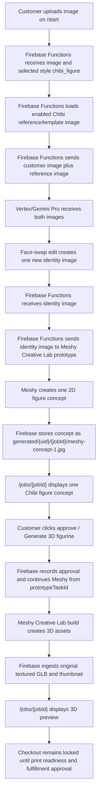

# Chibi Face Swap Creative Lab Workflow

This document explains the current Chibi figurine workflow explicitly. Chibi does not create multiple customer-reviewable proof options in this path. The customer sees one Meshy-generated concept image, approves that concept, and then Meshy builds the 3D preview from the stored prototype task.

## Short Version

- Style ID: `chibi_figure`
- Public label: `Chibi heroic fantasy male` (renamed 2026-07-09; previously `Chibi`)
- Product type: `figurine`
- Proof mode: `template_face_swap`
- 3D workflow: `creative_lab_figure`
- Customer upload page: `/start`
- Customer review page: `/jobs/{jobId}`
- Vertex/Gemini output: one face-swapped identity image
- Meshy prototype output: one customer-reviewable 2D figure concept
- Meshy build output: original textured GLB preview
- Checkout: locked until print-readiness and fulfillment approval

## End-To-End Flow



## What Each System Does

| System | Responsibility | Output |
| --- | --- | --- |
| Customer | Uploads a source photo and selects Chibi on `/start`. | Uploaded customer image in Storage. |
| Firebase Functions | Creates the job, reads workflow config, loads the enabled Chibi reference/template image, and calls Vertex/Gemini in `template_face_swap` mode. | One face-swapped identity image, usually `generated/{uid}/{jobId}/preview.png`. |
| Vertex/Gemini Pro | Edits the Chibi reference/template so the head/face identity comes from the customer photo while the template controls style, pose, costume, and figure design. | One new identity image. |
| Firebase Functions | Immediately submits the face-swapped identity image to Meshy Creative Lab prototype for Chibi Creative Lab styles. | Meshy prototype task ID and concept image path. |
| Meshy Creative Lab prototype | Creates the customer-reviewable 2D figure concept. | One concept image, usually `generated/{uid}/{jobId}/meshy-concept-1.jpg`. |
| Customer | Reviews the single concept image on `/jobs/{jobId}`. | Approval action. |
| Firebase Functions | Records the approval and calls the Meshy build phase using the stored `figurineConcept.prototypeTaskId`. | Build task and ingested 3D asset records. |
| Meshy Creative Lab build | Builds the 3D figure from the approved prototype task. | Original textured `model.glb`, thumbnail, and any upstream formats Meshy returns. |
| Firebase Storage / job page | Stores and displays the original textured GLB preview. | Preview-only 3D model on `/jobs/{jobId}`. |

## Job State Shape

Before customer approval, the Chibi Creative Lab face-swap path should look like this:

```json
{
  "selectedStyle": "chibi_figure",
  "selectedStyleLabel": "Chibi",
  "productType": "figurine",
  "generated3dWorkflow": "creative_lab_figure",
  "conceptSource": "meshy_prototype_concept",
  "generatedImages": [
    {
      "id": "meshy-concept-1",
      "label": "Chibi figure concept",
      "storagePath": "generated/{uid}/{jobId}/meshy-concept-1.jpg",
      "status": "ready",
      "isPlaceholder": false
    }
  ],
  "figurineConcept": {
    "prototypeTaskId": "{meshyPrototypeTaskId}",
    "faceSwapImagePath": "generated/{uid}/{jobId}/preview.png",
    "conceptImagePaths": [
      "generated/{uid}/{jobId}/meshy-concept-1.jpg"
    ],
    "status": "concept_ready"
  }
}
```

After customer approval and Meshy build, the job should also have:

```json
{
  "status": "approved",
  "conceptSource": "approved_2d_proof",
  "approvedImagePath": "generated/{uid}/{jobId}/meshy-concept-1.jpg",
  "figurineGeneration": {
    "provider": "meshy",
    "workflow": "creative_lab_figure",
    "prototypeTaskId": "{meshyPrototypeTaskId}",
    "buildTaskId": "{meshyBuildTaskId}",
    "availableFormats": ["glb", "obj", "mtl"]
  },
  "figurinePreview": {
    "status": "preview_ready",
    "previewGlb": "print-files/{uid}/{jobId}/figurine/creative-lab-original/model.glb",
    "thumbnail": "print-files/{uid}/{jobId}/figurine/creative-lab-original/thumbnail.png",
    "printReadiness": "needs_review"
  },
  "checkoutEligibility": {
    "eligible": false,
    "reason": "Figurine checkout is locked until printability and slicer review are complete."
  }
}
```

The `conceptSource` value changes during approval because `approveGeneratedImage` records the approved concept as the selected 2D input for the figurine build. The Chibi-specific prototype handoff is still preserved by `figurineConcept.prototypeTaskId`.

## Concrete Trace: Job `749963ef-9164-4fb5-beb9-306060bb198a`

The live job record and local mirrored asset metadata show this exact path:

| Field or artifact | Value |
| --- | --- |
| Job ID | `749963ef-9164-4fb5-beb9-306060bb198a` |
| UID | `55Iq3LogLaPIBT9CGT9kkGJRT2t2` |
| `selectedStyle` | `chibi_figure` |
| `selectedStyleLabel` | `Chibi` |
| `aiGeneration.provider` | `vertex-gemini-direct` |
| `aiGeneration.metadata.proofMode` | `template_face_swap` |
| `aiGeneration.generatedImagePaths` | `generated/55Iq3LogLaPIBT9CGT9kkGJRT2t2/749963ef-9164-4fb5-beb9-306060bb198a/preview.png` |
| `aiGeneration.metadata.referenceImageCount` | `1` |
| `generatedImages[0].id` | `meshy-concept-1` |
| `generatedImages[0].label` | `Chibi figure concept` |
| `generatedImages[0].storagePath` | `generated/55Iq3LogLaPIBT9CGT9kkGJRT2t2/749963ef-9164-4fb5-beb9-306060bb198a/meshy-concept-1.jpg` |
| `conceptSource` after approval | `approved_2d_proof` |
| `approvedImagePath` | `generated/55Iq3LogLaPIBT9CGT9kkGJRT2t2/749963ef-9164-4fb5-beb9-306060bb198a/meshy-concept-1.jpg` |
| `figurineConcept.faceSwapImagePath` | `generated/55Iq3LogLaPIBT9CGT9kkGJRT2t2/749963ef-9164-4fb5-beb9-306060bb198a/preview.png` |
| `figurineConcept.prototypeTaskId` | `019f2dfa-26c6-74d6-b338-3eee1d3caf5e` |
| `figurineGeneration.buildTaskId` | `019f2dfb-4775-7bc2-b6d6-bd22578333cb` |
| `figurineGeneration.availableFormats` | `glb`, `obj`, `mtl` |
| `figurinePreview.previewGlb` | `print-files/55Iq3LogLaPIBT9CGT9kkGJRT2t2/749963ef-9164-4fb5-beb9-306060bb198a/figurine/creative-lab-original/model.glb` |
| Local mirrored metadata | `.tmp/print-files/55Iq3LogLaPIBT9CGT9kkGJRT2t2/749963ef-9164-4fb5-beb9-306060bb198a/figurine/creative-lab-original/metadata.json` |

The local mirrored Meshy metadata confirms that the Creative Lab build source was the single Meshy concept:

```json
{
  "sourceImagePath": "generated/55Iq3LogLaPIBT9CGT9kkGJRT2t2/749963ef-9164-4fb5-beb9-306060bb198a/meshy-concept-1.jpg",
  "previewGlb": "print-files/55Iq3LogLaPIBT9CGT9kkGJRT2t2/749963ef-9164-4fb5-beb9-306060bb198a/figurine/creative-lab-original/model.glb",
  "thumbnailPath": "print-files/55Iq3LogLaPIBT9CGT9kkGJRT2t2/749963ef-9164-4fb5-beb9-306060bb198a/figurine/creative-lab-original/thumbnail.png"
}
```

## Not The Multiple-Proof Path

This workflow should not be described as "multiple Chibi proofs." That phrase belongs to the older `generated_options` style flow, where Vertex/Gemini can generate multiple proof cards before a 3D provider is called.

For Chibi face swap into Creative Lab:

- Vertex/Gemini creates one face-swapped identity image.
- Meshy prototype creates one reviewable 2D concept image.
- The customer approves that one Meshy concept image.
- Meshy build creates the 3D assets after approval.

## Source Pointers

- Workflow config and proof modes: `apps/functions/src/figurineWorkflowConfig.ts`
- Vertex/Gemini face-swap routing: `apps/functions/src/aiProvider.ts`
- Chibi concept generation branch: `apps/functions/src/index.ts`
- Meshy Creative Lab prototype/build adapter: `apps/functions/src/meshyFigurineProvider.ts`
- Customer upload UI: `apps/web/components/UploadFlow.tsx`
- Customer review UI: `apps/web/components/JobDetail.tsx`
- Overview doc: `docs/Workflows/figurine-and-operator-workflows.md`
