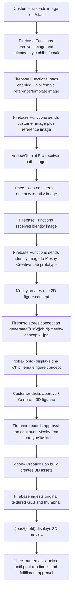

# Chibi Female Face Swap Creative Lab Workflow

This document duplicates the Chibi face-swap Creative Lab path for a female style template. The customer still sees one Meshy-generated concept image, approves that concept, and then Meshy builds the 3D preview from the stored Creative Lab prototype task.

The female variant differs from the base Chibi workflow only by style ID, public label, and the enabled template/reference image.

## Short Version

- Style ID: `chibi_female`
- Public label: `Chibi female`
- Product type: `figurine`
- Proof mode: `template_face_swap`
- 3D workflow: `creative_lab_figure`
- Local seed reference image: `C:\Users\Eliud\Desktop\Styles\SheRa-ChatGPTv4 Christina.png`
- Seeded Storage reference path: `admin/workflow-style-references/chibi_female/shera-christina-template.png`
- Customer upload page: `/start`
- Customer review page: `/jobs/{jobId}`
- Vertex/Gemini output: one face-swapped identity image
- Meshy prototype output: one customer-reviewable 2D figure concept
- Meshy build output: original textured GLB preview
- Checkout: locked until print-readiness and fulfillment approval

## End-To-End Flow



## Reference Image Setup

The seed script for this workflow is:

```bash
npm --workspace apps/functions run seed:chibi-female-workflow
```

For a no-write check:

```bash
npm --workspace apps/functions run seed:chibi-female-workflow:dry-run
```

The script reads `C:\Users\Eliud\Desktop\Styles\SheRa-ChatGPTv4 Christina.png`, uploads it to `admin/workflow-style-references/chibi_female/shera-christina-template.png`, and upserts this style in `adminConfig/figurineWorkflow`:

```json
{
  "id": "chibi_female",
  "label": "Chibi female",
  "productType": "figurine",
  "proofMode": "template_face_swap",
  "generationWorkflow": "creative_lab_figure",
  "enabled": true,
  "referenceImages": [
    {
      "id": "shera-christina-template",
      "label": "SheRa Christina",
      "storagePath": "admin/workflow-style-references/chibi_female/shera-christina-template.png",
      "mimeType": "image/png",
      "enabled": true
    }
  ]
}
```

`template_face_swap` requires at least one enabled reference image. If the style exists without the seeded reference image, proof generation should fail before Meshy is called.

## What Each System Does

| System                       | Responsibility                                                                                                                                                         | Output                                                                            |
| ---------------------------- | ---------------------------------------------------------------------------------------------------------------------------------------------------------------------- | --------------------------------------------------------------------------------- |
| Customer                     | Uploads a source photo and selects Chibi female on `/start`.                                                                                                           | Uploaded customer image in Storage.                                               |
| Firebase Functions           | Creates the job, reads workflow config, loads the enabled Chibi female reference/template image, and calls Vertex/Gemini in `template_face_swap` mode.                 | One face-swapped identity image, usually `generated/{uid}/{jobId}/preview.png`.   |
| Vertex/Gemini Pro            | Edits the Chibi female reference/template so the head/face identity comes from the customer photo while the template controls style, pose, costume, and figure design. | One new identity image.                                                           |
| Firebase Functions           | Immediately submits the face-swapped identity image to Meshy Creative Lab prototype for the Chibi female style.                                                        | Meshy prototype task ID and concept image path.                                   |
| Meshy Creative Lab prototype | Creates the customer-reviewable 2D figure concept.                                                                                                                     | One concept image, usually `generated/{uid}/{jobId}/meshy-concept-1.jpg`.         |
| Customer                     | Reviews the single concept image on `/jobs/{jobId}`.                                                                                                                   | Approval action.                                                                  |
| Firebase Functions           | Records the approval and calls the Meshy build phase using the stored `figurineConcept.prototypeTaskId`.                                                               | Build task and ingested 3D asset records.                                         |
| Meshy Creative Lab build     | Builds the 3D figure from the approved prototype task.                                                                                                                 | Original textured `model.glb`, thumbnail, and any upstream formats Meshy returns. |
| Firebase Storage / job page  | Stores and displays the original textured GLB preview.                                                                                                                 | Preview-only 3D model on `/jobs/{jobId}`.                                         |

## Job State Shape

Before customer approval, the Chibi female Creative Lab face-swap path should look like this:

```json
{
  "selectedStyle": "chibi_female",
  "selectedStyleLabel": "Chibi female",
  "productType": "figurine",
  "generated3dWorkflow": "creative_lab_figure",
  "conceptSource": "meshy_prototype_concept",
  "generatedImages": [
    {
      "id": "meshy-concept-1",
      "label": "Chibi female figure concept",
      "storagePath": "generated/{uid}/{jobId}/meshy-concept-1.jpg",
      "status": "ready",
      "isPlaceholder": false
    }
  ],
  "figurineConcept": {
    "prototypeTaskId": "{meshyPrototypeTaskId}",
    "faceSwapImagePath": "generated/{uid}/{jobId}/preview.png",
    "conceptImagePaths": ["generated/{uid}/{jobId}/meshy-concept-1.jpg"],
    "status": "concept_ready"
  }
}
```

After customer approval and Meshy build, the job should also have:

```json
{
  "status": "approved",
  "conceptSource": "approved_2d_proof",
  "approvedImagePath": "generated/{uid}/{jobId}/meshy-concept-1.jpg",
  "figurineGeneration": {
    "provider": "meshy",
    "workflow": "creative_lab_figure",
    "prototypeTaskId": "{meshyPrototypeTaskId}",
    "buildTaskId": "{meshyBuildTaskId}",
    "availableFormats": ["glb", "obj", "mtl"]
  },
  "figurinePreview": {
    "status": "preview_ready",
    "previewGlb": "print-files/{uid}/{jobId}/figurine/creative-lab-original/model.glb",
    "thumbnail": "print-files/{uid}/{jobId}/figurine/creative-lab-original/thumbnail.png",
    "printReadiness": "needs_review"
  },
  "checkoutEligibility": {
    "eligible": false,
    "reason": "Figurine checkout is locked until printability and slicer review are complete."
  }
}
```

## Not The Multiple-Proof Path

This workflow should not be described as "multiple Chibi female proofs." The same single-concept rule from the base Chibi path applies:

- Vertex/Gemini creates one face-swapped identity image.
- Meshy prototype creates one reviewable 2D concept image.
- The customer approves that one Meshy concept image.
- Meshy build creates the 3D assets after approval.

## Current Trace Status

No completed Chibi female production job trace is recorded yet. After the first successful run, add the concrete job ID, UID, generated paths, Meshy prototype/build task IDs, and local mirrored metadata path here, following the trace format in `docs/Workflows/chibi-face-swap-creative-lab-workflow.md`.

## Source Pointers

- Workflow config and proof modes: `apps/functions/src/figurineWorkflowConfig.ts`
- Seed script: `apps/functions/scripts/seed-chibi-female-workflow.mjs`
- Vertex/Gemini face-swap routing: `apps/functions/src/aiProvider.ts`
- Creative Lab concept generation branch: `apps/functions/src/index.ts`
- Meshy Creative Lab prototype/build adapter: `apps/functions/src/meshyFigurineProvider.ts`
- Customer upload UI: `apps/web/components/UploadFlow.tsx`
- Customer review UI: `apps/web/components/JobDetail.tsx`
- Overview doc: `docs/Workflows/figurine-and-operator-workflows.md`
