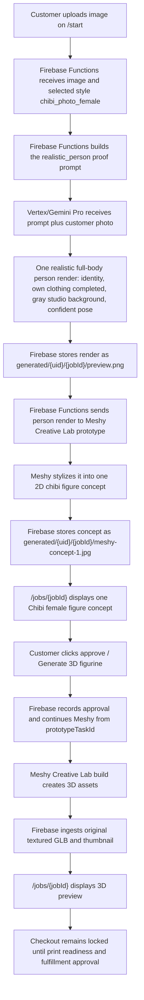

# Chibi Female Photo Creative Lab Workflow

This document duplicates the Chibi male photo Creative Lab path for the female style. The customer's photo is rendered by Vertex/Gemini as one clean, realistic full-body person (internal cleanup, never customer-reviewed), Meshy Creative Lab's prototype phase does all chibi stylization, the customer approves the one Meshy concept image, and Meshy builds the 3D preview from the stored prototype task.

The female variant differs from the Chibi male photo workflow only by style ID, public label, and the subject line in the style prompt. See [Chibi Male Photo Creative Lab Workflow](./chibi-male-photo-creative-lab-workflow.md) for the full flow, system responsibilities, and design rationale.

## Short Version

- Style ID: `chibi_photo_female`
- Public label: `Chibi female`
- Product type: `figurine`
- Proof mode: `generated_options`
- Proof rendering: `realistic_person`
- 3D workflow: `creative_lab_figure`
- Reference images: none (this is not a template style)
- Customer upload page: `/start`
- Customer review page: `/jobs/{jobId}`
- Vertex/Gemini output: one realistic full-body person render (internal only)
- Meshy prototype output: one customer-reviewable 2D figure concept
- Meshy build output: original textured GLB preview
- Checkout: locked until print-readiness and fulfillment approval

## End-To-End Flow



## Style Setup

There is no reference image to upload. Both photo-driven chibi styles share one seed script:

```bash
npm --workspace apps/functions run seed:chibi-photo-workflows
```

For a no-write check:

```bash
npm --workspace apps/functions run seed:chibi-photo-workflows:dry-run
```

The script upserts this style in `adminConfig/figurineWorkflow`:

```json
{
  "id": "chibi_photo_female",
  "label": "Chibi female",
  "productType": "figurine",
  "proofMode": "generated_options",
  "proofRendering": "realistic_person",
  "generationWorkflow": "creative_lab_figure",
  "prompt": "The subject is female; preserve her hairstyle and hair length exactly as in the photo.",
  "enabled": true,
  "referenceImages": []
}
```

The style `prompt` is only the subject line. The full realistic-person scaffold lives in the `realistic_person` branch of `buildFigurineProofPrompt` in `apps/functions/src/aiProvider.ts`.

## Job State Shape

Identical to the Chibi male photo path except for the style fields and labels:

```json
{
  "selectedStyle": "chibi_photo_female",
  "selectedStyleLabel": "Chibi female",
  "productType": "figurine",
  "generated3dWorkflow": "creative_lab_figure",
  "conceptSource": "meshy_prototype_concept",
  "generatedImages": [
    {
      "id": "meshy-concept-1",
      "label": "Chibi female figure concept",
      "storagePath": "generated/{uid}/{jobId}/meshy-concept-1.jpg",
      "status": "ready",
      "isPlaceholder": false
    }
  ],
  "figurineConcept": {
    "prototypeTaskId": "{meshyPrototypeTaskId}",
    "faceSwapImagePath": "generated/{uid}/{jobId}/preview.png",
    "conceptImagePaths": ["generated/{uid}/{jobId}/meshy-concept-1.jpg"],
    "status": "concept_ready"
  }
}
```

`figurineConcept.faceSwapImagePath` is a historical field name; for this style it holds the realistic person render that fed the Meshy prototype. The post-approval shape matches the Chibi male photo document.

## Not The Multiple-Proof Path

Same single-concept rule as every chibi Creative Lab path — `createGenerationJob` forces the Vertex proof count to 1 for `realistic_person` styles:

- Vertex/Gemini creates one realistic person render (internal only).
- Meshy prototype creates one reviewable 2D concept image.
- The customer approves that one Meshy concept image.
- Meshy build creates the 3D assets after approval.

## Current Trace Status

No completed Chibi female photo production job trace is recorded yet. Pre-production validation evidence (2026-07-08, `Subject Female` test photo) lives in `.tmp/chibi-person-cleanup-tests/`. After the first successful run, add the concrete job ID, UID, generated paths, Meshy prototype/build task IDs, and local mirrored metadata path here, following the trace format in `docs/Workflows/chibi-face-swap-creative-lab-workflow.md`.

## Source Pointers

- Full flow and rationale: `docs/Workflows/chibi-male-photo-creative-lab-workflow.md`
- Workflow config, `proofRendering` flag, and proof modes: `apps/functions/src/figurineWorkflowConfig.ts`
- Seed script: `apps/functions/scripts/seed-chibi-photo-workflows.mjs`
- `realistic_person` proof prompt branch: `apps/functions/src/aiProvider.ts` (`buildFigurineProofPrompt`)
- Concept-gate routing (`usesRealisticPersonConceptGate`): `apps/functions/src/index.ts`
- Meshy Creative Lab prototype/build adapter: `apps/functions/src/meshyFigurineProvider.ts`
- Customer upload UI: `apps/web/components/UploadFlow.tsx`
- Customer review UI: `apps/web/components/JobDetail.tsx`
- Overview doc: `docs/Workflows/figurine-and-operator-workflows.md`
