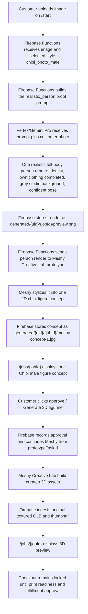

# Chibi Male Photo Creative Lab Workflow

This document explains the photo-driven Chibi male figurine workflow. Unlike the template-face-swap Chibi paths, this style has no admin reference/template image. Vertex/Gemini renders the customer photo as one clean, realistic full-body person (identity preserved, own clothing completed head to toe, gray studio background, confident pose) as an internal cleanup step the customer never reviews. Meshy Creative Lab's prototype phase does all the chibi stylization. The customer sees one Meshy-generated concept image, approves that concept, and then Meshy builds the 3D preview from the stored prototype task.

The realistic-person cleanup exists because raw customer photos sent directly to Creative Lab produce uncontrolled results (validated 2026-07-08: cropped photos come back with invented or missing clothing, and photo backgrounds leak into the 3D model as scenery and pedestals). The cleanup render guarantees a fully dressed, full-body, prop-free subject before any Meshy credits are spent.

## Short Version

- Style ID: `chibi_photo_male`
- Public label: `Chibi male`
- Product type: `figurine`
- Proof mode: `generated_options`
- Proof rendering: `realistic_person`
- 3D workflow: `creative_lab_figure`
- Reference images: none (this is not a template style)
- Customer upload page: `/start`
- Customer review page: `/jobs/{jobId}`
- Vertex/Gemini output: one realistic full-body person render (internal only)
- Meshy prototype output: one customer-reviewable 2D figure concept
- Meshy build output: original textured GLB preview
- Checkout: locked until print-readiness and fulfillment approval

## End-To-End Flow



## Style Setup

There is no reference image to upload. The seed script for both photo-driven chibi styles is:

```bash
npm --workspace apps/functions run seed:chibi-photo-workflows
```

For a no-write check:

```bash
npm --workspace apps/functions run seed:chibi-photo-workflows:dry-run
```

The script upserts this style in `adminConfig/figurineWorkflow` (it also seeds `chibi_photo_female` and renames the template-swap chibi pair to `Chibi heroic fantasy male/female`):

```json
{
  "id": "chibi_photo_male",
  "label": "Chibi male",
  "productType": "figurine",
  "proofMode": "generated_options",
  "proofRendering": "realistic_person",
  "generationWorkflow": "creative_lab_figure",
  "prompt": "The subject is male; preserve his facial hair (beard, mustache, stubble, or clean-shaven) exactly as in the photo.",
  "enabled": true,
  "referenceImages": []
}
```

The style `prompt` is only the subject line. The full realistic-person scaffold (identity preservation, clothing completion, gray background, confident pose, framing, no props/base) is the `realistic_person` branch of `buildFigurineProofPrompt` in `apps/functions/src/aiProvider.ts`. A style prompt alone cannot override the default stylized scaffold — that is why `proofRendering` exists as a per-style flag.

## What Each System Does

| System                       | Responsibility                                                                                                                                                              | Output                                                                            |
| ---------------------------- | ---------------------------------------------------------------------------------------------------------------------------------------------------------------------------- | --------------------------------------------------------------------------------- |
| Customer                     | Uploads a source photo and selects Chibi male on `/start`.                                                                                                                  | Uploaded customer image in Storage.                                               |
| Firebase Functions           | Creates the job, reads workflow config, forces the proof count to 1, and calls Vertex/Gemini with the `realistic_person` proof prompt.                                      | One realistic person render, `generated/{uid}/{jobId}/preview.png`.               |
| Vertex/Gemini Pro            | Renders the customer as a clean realistic full-body person: identity and facial hair preserved, own clothing completed head to toe, gray studio background, confident pose. | One person render (never shown to the customer).                                  |
| Firebase Functions           | Immediately submits the person render to Meshy Creative Lab prototype.                                                                                                     | Meshy prototype task ID and concept image path.                                   |
| Meshy Creative Lab prototype | Does all chibi stylization and creates the customer-reviewable 2D figure concept.                                                                                           | One concept image, usually `generated/{uid}/{jobId}/meshy-concept-1.jpg`.         |
| Customer                     | Reviews the single concept image on `/jobs/{jobId}`.                                                                                                                        | Approval action.                                                                  |
| Firebase Functions           | Records the approval and calls the Meshy build phase using the stored `figurineConcept.prototypeTaskId`.                                                                    | Build task and ingested 3D asset records.                                         |
| Meshy Creative Lab build     | Builds the 3D figure from the approved prototype task.                                                                                                                      | Original textured `model.glb`, thumbnail, and any upstream formats Meshy returns. |
| Firebase Storage / job page  | Stores and displays the original textured GLB preview.                                                                                                                      | Preview-only 3D model on `/jobs/{jobId}`.                                         |

## Job State Shape

Before customer approval, the Chibi male photo path should look like this:

```json
{
  "selectedStyle": "chibi_photo_male",
  "selectedStyleLabel": "Chibi male",
  "productType": "figurine",
  "generated3dWorkflow": "creative_lab_figure",
  "conceptSource": "meshy_prototype_concept",
  "generatedImages": [
    {
      "id": "meshy-concept-1",
      "label": "Chibi male figure concept",
      "storagePath": "generated/{uid}/{jobId}/meshy-concept-1.jpg",
      "status": "ready",
      "isPlaceholder": false
    }
  ],
  "figurineConcept": {
    "prototypeTaskId": "{meshyPrototypeTaskId}",
    "faceSwapImagePath": "generated/{uid}/{jobId}/preview.png",
    "conceptImagePaths": ["generated/{uid}/{jobId}/meshy-concept-1.jpg"],
    "status": "concept_ready"
  }
}
```

Note: `figurineConcept.faceSwapImagePath` is a historical field name shared with the template-face-swap paths. For this style it holds the realistic person render that fed the Meshy prototype, not a face swap.

After customer approval and Meshy build, the job should also have:

```json
{
  "status": "approved",
  "conceptSource": "approved_2d_proof",
  "approvedImagePath": "generated/{uid}/{jobId}/meshy-concept-1.jpg",
  "figurineGeneration": {
    "provider": "meshy",
    "workflow": "creative_lab_figure",
    "prototypeTaskId": "{meshyPrototypeTaskId}",
    "buildTaskId": "{meshyBuildTaskId}",
    "availableFormats": ["glb", "obj", "mtl"]
  },
  "figurinePreview": {
    "status": "preview_ready",
    "previewGlb": "print-files/{uid}/{jobId}/figurine/creative-lab-original/model.glb",
    "thumbnail": "print-files/{uid}/{jobId}/figurine/creative-lab-original/thumbnail.png",
    "printReadiness": "needs_review"
  },
  "checkoutEligibility": {
    "eligible": false,
    "reason": "Figurine checkout is locked until printability and slicer review are complete."
  }
}
```

## Not The Multiple-Proof Path

Although this style uses `proofMode: generated_options`, the `realistic_person` proof rendering routes it through the same single-concept gate as the face-swap chibi paths. `createGenerationJob` forces the Vertex proof count to 1 for these styles:

- Vertex/Gemini creates one realistic person render (internal only).
- Meshy prototype creates one reviewable 2D concept image.
- The customer approves that one Meshy concept image.
- Meshy build creates the 3D assets after approval.

## Validation Evidence (Pre-Production)

No completed production job trace is recorded yet. The pipeline stages were validated end to end on 2026-07-08 with local test harnesses using the standard test subjects (`C:\Users\Eliud\Desktop\Styles\Subject Male` / `Subject Female`):

- Raw photo directly to Creative Lab (rejected design): concepts/builds and harness in `.tmp/chibi-direct-meshy-tests/`. The male subject came back without pants; the female came back with a window diorama and pedestal baked into the GLB.
- Person render to Creative Lab (shipped design): person renders, concepts, thumbnails, GLBs, and harness in `.tmp/chibi-person-cleanup-tests/`. Clean chibi figurines with complete outfits.

After the first successful production run, add the concrete job ID, UID, generated paths, Meshy prototype/build task IDs, and local mirrored metadata path here, following the trace format in `docs/Workflows/chibi-face-swap-creative-lab-workflow.md`.

## Source Pointers

- Workflow config, `proofRendering` flag, and proof modes: `apps/functions/src/figurineWorkflowConfig.ts`
- Seed script: `apps/functions/scripts/seed-chibi-photo-workflows.mjs`
- `realistic_person` proof prompt branch: `apps/functions/src/aiProvider.ts` (`buildFigurineProofPrompt`)
- Concept-gate routing (`usesRealisticPersonConceptGate`): `apps/functions/src/index.ts`
- Meshy Creative Lab prototype/build adapter: `apps/functions/src/meshyFigurineProvider.ts`
- Customer upload UI: `apps/web/components/UploadFlow.tsx`
- Customer review UI: `apps/web/components/JobDetail.tsx`
- Female variant: `docs/Workflows/chibi-female-photo-creative-lab-workflow.md`
- Overview doc: `docs/Workflows/figurine-and-operator-workflows.md`
