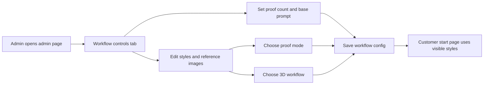
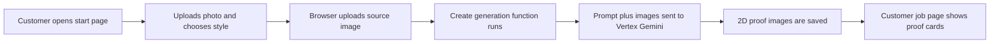
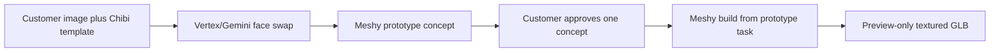
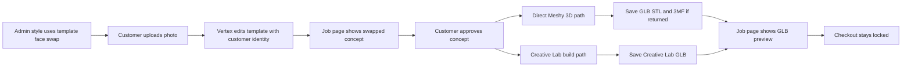
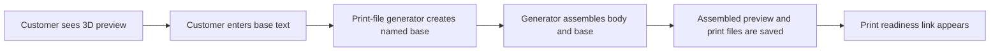
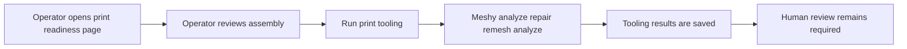
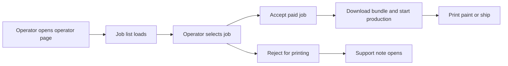

# Figurine And Operator Workflows

Status: current implementation map as of 2026-07-05.

This document explains the current app workflows in plain language. It focuses on what the customer sees, where proof generation happens, how the style choices change the backend path, which Vertex/Gemini and Meshy calls are used, and what the operator/admin consoles control.

Rendering note: these are live Mermaid diagrams. VS Code 1.121 and newer can render them with the built-in Markdown preview, without a Mermaid extension. Exact routes, Storage paths, callable names, and endpoint names are kept in the text around each diagram.

## Quick Answer

Proof generation is the 2D image stage. It happens before Meshy makes a 3D model.

In the generated-options figurine path:

1. Customer uses `/start`.
2. Customer signs in or continues as guest.
3. Customer uploads a JPG/PNG source photo.
4. Customer chooses a visible style from the workflow config.
5. The browser uploads the source photo to Firebase Storage under `uploads/{uid}/{jobId}/source.{jpg|png}`.
6. The browser calls the Firebase callable `createGenerationJob`.
7. `createGenerationJob` reads the admin workflow config, builds the proof prompt, attaches the customer image and any enabled style reference images, and calls Vertex/Gemini through `apps/functions/src/aiProvider.ts`.
8. Vertex/Gemini writes one to four 2D proof images under `generated/{uid}/{jobId}/`.
9. Customer lands on `/jobs/{jobId}` and reviews proof cards.
10. Customer clicks `Generate 3D figurine`.
11. The browser calls `approveGeneratedImage`.
12. `approveGeneratedImage` approves that 2D proof and then calls Meshy through the server-side provider adapter.
13. The customer sees the Storage-backed GLB preview on `/jobs/{jobId}`.
14. Checkout stays locked for figurines until print readiness and fulfillment are explicitly approved later.

Current Chibi uses `template_face_swap` and is different: Vertex/Gemini creates one identity image, Meshy creates one reviewable concept image, and approval continues the Meshy build from the stored prototype task. See [Chibi Face Swap Creative Lab Workflow](./chibi-face-swap-creative-lab-workflow.md) and [Chibi Female Face Swap Creative Lab Workflow](./chibi-female-face-swap-creative-lab-workflow.md).

The important split:

- Vertex/Gemini creates 2D customer-reviewable proof images.
- Meshy creates or checks 3D model artifacts after a proof or direct-3D input is approved.
- The print-file generator assembles deterministic product parts such as the reusable base and customer name sign.

## Workflow 1: Workflow Controls Configure The Public Flow

The `/admin` page is titled `Operator console`, but it has two tabs:

- `Support jobs`: admin/support triage.
- `Workflow controls`: public style and proof-generation settings.

Workflow controls save the config at `adminConfig/figurineWorkflow`. The public `/start` page reads that config through `getFigurineWorkflowConfig`.

Plain meaning:

- `Proof options` controls how many 2D proof images Vertex/Gemini should try to make. Current max is 4.
- `Base proof prompt` is the common instruction for generated figurine proofs.
- Each style has its own prompt and can be public or hidden.
- Each style chooses a proof mode and a 3D workflow.
- Reference images are admin-owned style/template images. They are not customer uploads.

Important current limitation:

- Posture is not exposed as a public picker yet. Current figurine jobs are stored as `postureMode: "natural"`, and the Vertex figurine prompt asks for a natural standing pose.

## Workflow 2: Customer Upload And Proof Generation

This is where "proof generation" comes in.

Plain meaning:

- `/start` is the upload and style-selection page.
- The customer sees the selected source image, style selector, proof option count, and `Generate` button.
- `createGenerationJob` does not call Meshy for the normal generated-options path. It creates customer-reviewable 2D proof images first.
- The customer sees those proof images on `/jobs/{jobId}`.

Vertex/Gemini details:

- Provider route: `vertex-gemini-direct` by default.
- Default image model in code: `gemini-3-pro-image`.
- Runtime override: `VERTEX_IMAGE_MODEL`.
- Endpoint shape: Vertex Express `:generateContent` under `https://aiplatform.googleapis.com/v1`, unless `VERTEX_EXPRESS_BASE_URL` overrides it.
- Request parts: prompt text, the customer source image, then any enabled admin reference images.
- Response expected: image output plus optional text/model metadata.

Proof image storage:

- Single proof: `generated/{uid}/{jobId}/preview.{ext}`
- Multiple proofs: `generated/{uid}/{jobId}/preview-1.{ext}`, `preview-2.{ext}`, etc.

## Workflow 3: Chibi Face Swap Into Meshy Creative Lab

Detailed source of truth:

- [Chibi Face Swap Creative Lab Workflow](./chibi-face-swap-creative-lab-workflow.md)
- [Chibi Female Face Swap Creative Lab Workflow](./chibi-female-face-swap-creative-lab-workflow.md)

Use those documents for the full Chibi sequence and job-state examples. This overview only records the contract:

- Style ID: `chibi_figure`
- Female style ID: `chibi_female`
- Proof mode: `template_face_swap`
- 3D workflow: `creative_lab_figure`
- Customer sees one Meshy-generated concept image, not multiple Chibi proofs.
- Approval continues Meshy build from the stored Creative Lab prototype task.

## Workflow 4: Template Face Swap Style Paths

This is the faithful/detail style family. The default visible examples include `Chibi female`, which uses Creative Lab, and `Heroic fantasy male` plus `Heroic fantasy female`, which use direct Multi-Image-to-3D. The code also supports either 3D workflow if an admin pairs `template_face_swap` with the matching style reference image.

It is used by:

- `Chibi female` in the default config
- `Heroic fantasy male` in the default config
- `Heroic fantasy female` in the default config
- Any admin-created style with `proofMode: template_face_swap`

Plain meaning:

- The first enabled style reference image is the fixed style template.
- Vertex edits that template so the face/head identity comes from the customer photo.
- The prompt in Workflow controls is the whole Vertex instruction for this mode.
- Direct Multi-Image-to-3D styles let the customer review the swapped image before spending direct 3D credits.
- Creative Lab styles can use Meshy's prototype concept gate before the customer approves the final build.

Important gotcha:

- `template_face_swap` requires at least one enabled admin reference image. If a style has no enabled template image, proof generation fails before Meshy is called.

Meshy details for this workflow:

- API root in provider code: `https://api.meshy.ai/openapi`.
- Direct model endpoint: `/multi-image-to-3d`
- Creative Lab concept endpoint: `/creative-lab/figure/v1/prototype`
- Creative Lab build endpoint: `/creative-lab/figure/v1/build`
- Direct Multi-Image-to-3D sends `image_urls`.
- Current request settings include `ai_model: "meshy-6"`, `should_texture: true`, `should_remesh: true`, `image_enhancement: true`, `remove_lighting: true`, `target_formats: ["glb", "stl", "3mf"]`, and `target_polycount: 100000`.
- After the model task, the provider may call `/print/analyze`.

## Workflow 5: Named Base And Body/Base Assembly

This is the deterministic product-package path. It starts after the customer has a 3D figurine preview.

Plain meaning:

- Meshy is responsible for the body/figurine preview.
- The reusable base, customer name, and body/base placement are deterministic print-file-generator work.
- Assembly does not make checkout ready by itself.

Current print-file generator endpoints:

- `/v1/figurine/named-base`
- `/v1/figurine/assemble`

Assembly output path:

`print-files/{uid}/{jobId}/figurine/assembled/{assemblyId}/`

## Workflow 6: Print-Readiness Tooling Review

This is the operator/review surface for generated print-tooling artifacts.

The page is `/jobs/{jobId}/print-readiness`. Operators usually reach it from `/operator` with `?operator=1`.

Plain meaning:

- Print tooling is not the same as the customer preview.
- The customer preview remains the original textured GLB.
- Repair/remesh outputs are for operator review, Blender/slicer checks, and future fulfillment decisions.
- The current UI shows assembled original, repaired GLB, remeshed GLB, remeshed STL status, warnings, and approximate provider cost.

Meshy print-tooling endpoints:

- `/print/analyze`
- `/print/repair`
- `/remesh`

Current review rule:

- These fields do not unlock checkout by themselves. `figurinePreview.printReadiness` remains `needs_review` until a later explicit product decision changes the gate.

## Workflow 7: Operator Fulfillment Console

The `/operator` page is the print console for paid jobs and production movement.

Plain meaning:

- `/operator` is not where proof prompts are edited.
- It is where paid/production jobs move through fulfillment.
- It also links to the customer-style preview page and the print-readiness review page.

Current operator actions:

- Accept job.
- Download or inspect print bundle/files.
- Start production.
- Toggle painted jobs between printing and painting.
- Mark shipped with carrier and tracking number.
- Reject for printing, which also opens a support note.

## Current Style Matrix

| Style | Public by default | Proof mode | 3D workflow | What Vertex/Gemini does | What Meshy does | What customer sees |
| --- | --- | --- | --- | --- | --- | --- |
| Creative Lab Figure | Yes | `generated_options` | `creative_lab_figure` | Creates up to 4 toy/chibi/emoji-like 2D proof options from the customer photo and optional style references. | Creative Lab prototype/build creates original textured GLB. | Multiple 2D proofs, then GLB preview after approval. |
| Chibi | Yes | `template_face_swap` | `creative_lab_figure` | Edits the enabled Chibi reference/template image with the customer's face/head identity. Prompt is sent exactly as written. | Creative Lab prototype creates the reviewable 2D concept, then build creates the original textured GLB after approval. | One Meshy concept image, then GLB preview after approval. |
| Chibi female | Yes | `template_face_swap` | `creative_lab_figure` | Edits the enabled SheRa/Christina-style female template image with the customer's face/head identity. Prompt is sent exactly as written. | Creative Lab prototype creates the reviewable 2D concept, then build creates the original textured GLB after approval. | One Meshy concept image, then GLB preview after approval. |
| Heroic fantasy male | Yes | `template_face_swap` | `direct_multi_image_to_3d` | Edits first enabled template reference image with the customer's face/head identity. Prompt is sent exactly as written. | Direct Multi-Image-to-3D creates GLB/STL/3MF candidates, then print analysis may run. | One swapped direct-3D input, then GLB preview after approval. |
| Heroic fantasy female | Yes | `template_face_swap` | `direct_multi_image_to_3d` | Edits first enabled Heroic Female template reference image with the customer's face/head identity. Prompt is sent exactly as written. | Direct Multi-Image-to-3D creates GLB/STL/3MF candidates, then print analysis may run. | One swapped direct-3D input, then GLB preview after approval. |
| Emoji Avatar | No | `generated_options` | `creative_lab_figure` | Creates emoji/avatar proof options if enabled. | Creative Lab prototype/build. | Same as Creative Lab flow if made public. |
| Bobblehead | No | `generated_options` | `creative_lab_figure` | Creates bobblehead proof options if enabled. | Creative Lab prototype/build. | Same as Creative Lab flow if made public. |
| Cartoon Figure | No | `generated_options` | `creative_lab_figure` | Creates cartoon proof options if enabled. | Creative Lab prototype/build. | Same as Creative Lab flow if made public. |

## Prompt And Endpoint Summary

### Vertex/Gemini

Where: `apps/functions/src/aiProvider.ts`

Used for:

- 2D proof generation.
- Template face-swap proof generation.

Current model behavior:

- Code default: `gemini-3-pro-image`.
- Runtime override: `VERTEX_IMAGE_MODEL`.
- Route metadata: `direct-gcp-vertex-gemini-express`.

Generated-options prompt ingredients:

- Base proof prompt from Workflow controls.
- Selected style label.
- Selected style prompt.
- Customer source image.
- Enabled admin style reference images, if any.
- Natural standing pose and body-only/no-base constraints for figurines.

Template-face-swap prompt ingredients:

- The selected style prompt only, sent as the full Vertex instruction.
- First enabled reference image is the style template.
- Customer photo is attached as the reference identity image.

### Meshy

Where: `apps/functions/src/meshyFigurineProvider.ts` and `apps/functions/src/meshyPrintTooling.ts`

Used for:

- 3D preview generation after proof approval.
- Provider printability analysis, repair, and remesh.

Current app Meshy behavior:

- Creative Lab Figure is image-driven: `image_url` plus `name`; no text prompt field is sent by the app.
- Direct Multi-Image-to-3D is image-driven: `image_urls` plus model/settings fields; no text prompt field is sent by the app.
- Older experiment runners may contain Meshy text-prompt experiments, but the current app workflow controls style through Vertex proof/template images first.

Generation endpoints:

- `/creative-lab/figure/v1/prototype`
- `/creative-lab/figure/v1/build`
- `/multi-image-to-3d`

Print-tooling endpoints:

- `/print/analyze`
- `/print/repair`
- `/remesh`

## What Each Page Is For

| Page | Human purpose | Main component | Main backend calls |
| --- | --- | --- | --- |
| `/start` | Customer uploads a photo, picks style, starts generation. | `UploadFlow` | `getFigurineWorkflowConfig`, `createGenerationJob` |
| `/jobs/{jobId}` | Customer reviews 2D proofs and later the 3D preview. | `JobDetail` | Firestore snapshot, `approveGeneratedImage`, `updateFigurineBaseConfig`, `createCheckoutSession` |
| `/jobs/{jobId}?operator=1` | Operator-safe view of the same job page with signed asset URLs. | `JobDetail` | `getAdminJobPreview` |
| `/jobs/{jobId}/print-readiness` | Review assembled and print-tooling artifacts. | `FigurinePrintReadinessReview` | Firestore snapshot, `runFigurinePrintTooling` |
| `/jobs/{jobId}/print-readiness?operator=1` | Operator-safe print-readiness page with signed asset URLs. | `FigurinePrintReadinessReview` | `getAdminJobPreview`, `runFigurinePrintTooling` |
| `/admin` | Admin/support console and workflow controls. | `AdminDashboard`, `AdminWorkflowConfig` | `getAdminFigurineWorkflowConfig`, `saveFigurineWorkflowConfig`, support callables |
| `/operator` | Production/fulfillment print console. | `OperatorConsole` | `getConsoleRole`, `listOperatorJobs`, `getOperatorJob`, `operatorAcceptJob`, `operatorUpdateFulfillment` |

## Source Map

| Area | Files |
| --- | --- |
| Customer upload and style selection | `apps/web/app/start/page.tsx`, `apps/web/components/UploadFlow.tsx` |
| Customer proof and 3D preview page | `apps/web/app/jobs/[jobId]/page.tsx`, `apps/web/components/JobDetail.tsx` |
| Workflow controls UI | `apps/web/components/AdminWorkflowConfig.tsx`, `apps/web/lib/figurineWorkflowConfig.ts` |
| Workflow config backend | `apps/functions/src/figurineWorkflowConfig.ts`, `apps/functions/src/index.ts` |
| Vertex/Gemini proof generation | `apps/functions/src/aiProvider.ts` |
| Meshy 3D preview provider | `apps/functions/src/meshyFigurineProvider.ts` |
| Figurine preview warnings and style detection | `apps/functions/src/figurineWorkflow.ts` |
| Named base and assembly orchestration | `apps/functions/src/index.ts`, `services/print-file-generator/app/main.py` |
| Print-readiness page and Meshy tooling | `apps/web/components/FigurinePrintReadinessReview.tsx`, `apps/functions/src/meshyPrintTooling.ts` |
| Operator fulfillment console | `apps/web/components/OperatorConsole.tsx`, `apps/functions/src/index.ts`, `apps/web/lib/pipeline.ts` |
| Durable workflow docs | `docs/MESHY_FIGURINE_UI_WORKFLOW.md`, `docs/PRINT_FILE_GENERATION_WORKFLOW.md`, `research/MESHY_SERVICE_IMPLEMENTATION_PLAN.md` |
