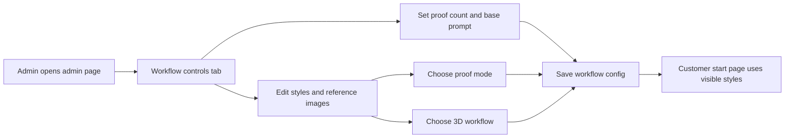
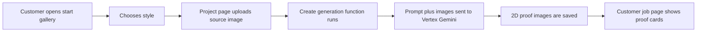
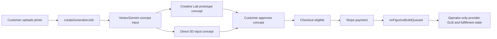
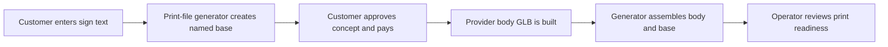
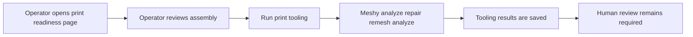
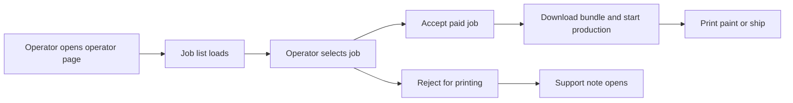

# Figurine And Operator Workflows

Status: current implementation map as of 2026-07-12.

This document explains the current app workflows in plain language. It focuses on what the customer sees, where proof generation happens, how the style choices change the backend path, which Vertex/Gemini and generated-3D provider calls are used, and what the operator/admin consoles control.

Rendering note: these are live Mermaid diagrams. VS Code 1.121 and newer can render them with the built-in Markdown preview, without a Mermaid extension. Exact routes, Storage paths, callable names, and endpoint names are kept in the text around each diagram.

## Quick Answer

Proof generation is the 2D image/concept stage. It happens before any paid provider 3D build. In the funded-build flow, figurine 3D asset generation runs after Stripe payment unless the job is on the manual studio-review fallback path, where an operator must release a reviewed concept before the existing build queue starts.

In the generic generated-options figurine path without a Creative Lab concept gate:

1. Customer uses `/start`.
2. Customer creates or signs into an email/password account.
3. Customer uploads a JPG/PNG source photo.
4. Customer chooses a visible style from the workflow config.
5. The browser uploads the source photo to Firebase Storage under `uploads/{uid}/{jobId}/source.{jpg|png}`.
6. The browser calls the Firebase callable `createGenerationJob`.
7. `createGenerationJob` records `generationState`, reads the admin workflow config, builds the proof prompt, attaches the customer image and any enabled style reference images, and calls Vertex/Gemini through `apps/functions/src/aiProvider.ts`.
8. Vertex/Gemini writes one to four 2D proof images under `generated/{uid}/{jobId}/`.
9. Customer lands on `/jobs/{jobId}` and reviews proof cards.
10. Customer approves a proof/concept.
11. The browser calls `approveGeneratedImage`.
12. `approveGeneratedImage` records the approved concept for figurines; it does not call Meshy or Hi3D.
13. Customer continues to the page-4 claim/checkout surface.
14. Stripe `checkout.session.completed` stamps `figurineBuild: queued` for normal paid figurine jobs, and `onFigurineBuildQueued` runs the selected provider path behind the server-side adapter.
15. Operator/support surfaces handle the generated 3D package, print readiness, and fulfillment state.

The style-specific concept contracts now live in one compact matrix: [Figurine Style Workflow Contracts](./figurine-style-workflow-contracts.md). Use that document for current style IDs, labels, proof modes, providers, and which image the customer reviews.

Current funded-build note: for chibi styles, approval claims the reviewed concept. The paid build later continues from the stored prototype task through the guarded post-payment build queue.

Generation recovery path:

- `createGenerationJob` updates `generationState.state`, `stage`, `startedAt`, `lastProgressAt`, `completedAt`, `failureCode`, and a customer-safe `publicMessage`.
- `reconcileStaleGenerationJobs` moves abandoned figurine generations into a terminal personal-studio-review state after the documented runtime plus grace period.
- `/jobs/{jobId}/manual-checkout` calls `createFallbackFigurineCheckoutSession` only for server-confirmed terminal figurine jobs owned by the signed-in customer.
- Fallback orders use `fulfillmentMode: "manual_proof_required"`. Stripe payment opens support/operator work and does not queue `figurineBuild`.
- Operators release a reviewed concept through `operatorUpdateFulfillment` action `release_manual_proof`; that stamps `approvedImagePath` and queues the existing guarded figurine build once.

The important split:

- Vertex/Gemini creates 2D customer-reviewable proof images or internal cleanup renders, depending on the selected workflow.
- Meshy Creative Lab or the selected direct generated-3D provider creates 3D model artifacts after payment, or after an operator releases a reviewed concept for manual studio-review orders.
- The print-file generator assembles deterministic product parts such as the reusable base and customer name sign.

## Workflow 1: Workflow Controls Configure The Public Flow

The `/admin` page is titled `Operator console`, but it has two tabs:

- `Support jobs`: admin/support triage.
- `Workflow controls`: public style and proof-generation settings.

Workflow controls save the config at `adminConfig/figurineWorkflow`. The public `/start` page reads that config through `getFigurineWorkflowConfig`.

Plain meaning:

- `Proof options` controls how many 2D proof images Vertex/Gemini should try to make. Current max is 4.
- `Base proof prompt` is the common instruction for generated figurine proofs.
- Each style has its own prompt and can be public or hidden.
- Each style chooses a proof mode and a 3D workflow.
- Reference images are admin-owned style/template images. They are not customer uploads.

Important current limitation:

- Posture is not exposed as a public picker yet. Current figurine jobs are stored as `postureMode: "natural"`, and the Vertex figurine prompt asks for a natural standing pose.

## Workflow 2: Customer Upload And Proof Generation

This is where "proof generation" comes in.

Plain meaning:

- `/start` is the style gallery.
- `/start/{styleId}` is the project page where the customer signs in, uploads the source image, and starts generation.
- `createGenerationJob` always owns the pre-payment concept path. Direct/generic generated-options paths store Vertex/Gemini proof images for review; Creative Lab concept-gate styles also call Meshy prototype before the customer reviews the final concept.
- The customer sees the reviewable concept on `/jobs/{jobId}`.

Vertex/Gemini details:

- Provider route: `vertex-gemini-direct` by default.
- Default image model in code: `gemini-3-pro-image`.
- Runtime override: `VERTEX_IMAGE_MODEL`.
- Endpoint shape: Vertex Express `:generateContent` under `https://aiplatform.googleapis.com/v1`, unless `VERTEX_EXPRESS_BASE_URL` overrides it.
- Request parts: prompt text, the customer source image, then any enabled admin reference images.
- Response expected: image output plus optional text/model metadata.

Proof image storage:

- Single proof: `generated/{uid}/{jobId}/preview.{ext}`
- Multiple proofs: `generated/{uid}/{jobId}/preview-1.{ext}`, `preview-2.{ext}`, etc.

## Workflow 3: Style-Specific Concept Paths

The current style matrix is [Figurine Style Workflow Contracts](./figurine-style-workflow-contracts.md). This overview only records the shared shape.

Plain meaning:

- `template_face_swap` means Vertex/Gemini edits the first enabled admin template image with the customer's identity.
- `generated_options` with `proofRendering: realistic_person` means Vertex/Gemini creates one internal realistic-person cleanup render before Meshy Creative Lab. The customer does not review that internal render.
- `creative_lab_figure` means Meshy Creative Lab prototype creates the customer-reviewed concept, and the paid build later continues from the stored prototype task.
- `direct_multi_image_to_3d` means the customer-reviewed swapped image is the later direct provider input. Hi3D is the current runtime provider for public direct styles, with Meshy `meshy-6` still available as the admin rollback provider.
- Customers see the 2D concept and the page-4 scene/claim surface. Provider GLBs and print-readiness stay operator-only.
- `template_face_swap` styles require at least one enabled admin reference image. If a style has no enabled template image, proof generation fails before Meshy or Hi3D is called.

## Workflow 5: Named Base And Body/Base Assembly

This is the deterministic product-package path. Under the funded-build inversion, customer sign text can be saved and the named-base artifact can be generated before payment, but body/base assembly waits until a provider body GLB exists after the paid build.

Plain meaning:

- Meshy or Hi3D is responsible for the body/figurine model, depending on the style contract.
- The reusable base, customer name, and body/base placement are deterministic print-file-generator work.
- Assembly is an operator/fulfillment concern and does not gate customer checkout by itself.

Current print-file generator endpoints:

- `/v1/figurine/named-base`
- `/v1/figurine/assemble`

Assembly output path:

`print-files/{uid}/{jobId}/figurine/assembled/{assemblyId}/`

## Workflow 6: Print-Readiness Tooling Review

This is the operator/review surface for generated print-tooling artifacts.

The page is `/jobs/{jobId}/print-readiness`. Operators usually reach it from `/operator` with `?operator=1`.

Plain meaning:

- Print tooling is not the same as the customer preview.
- Operator review uses the original/generated provider assets. The customer storyfront surface does not display provider GLBs.
- Repair/remesh outputs are for operator review, Blender/slicer checks, and future fulfillment decisions.
- The current UI shows assembled original, repaired GLB, remeshed GLB, remeshed STL status, warnings, and approximate provider cost.

Meshy print-tooling endpoints:

- `/print/analyze`
- `/print/repair`
- `/remesh`

Current review rule:

- These fields do not gate customer checkout by themselves. `figurinePreview.printReadiness` remains `needs_review` until a later explicit fulfillment decision changes the operator review rule.

## Workflow 7: Operator Fulfillment Console

The `/operator` page is the print console for paid jobs and production movement.

Plain meaning:

- `/operator` is not where proof prompts are edited.
- It is where paid/production jobs move through fulfillment.
- It also links to the customer-style preview page and the print-readiness review page.
- Opening the console authorizes through `listOperatorJobs` and returns the first 50 server-ordered rows in the same request. Tabs retain their loaded rows while refreshing, and additional rows use a cursor-backed `Load more` request.

Current operator actions:

- Accept job.
- Download or inspect print bundle/files.
- Start production.
- Toggle painted jobs between printing and painting.
- Mark shipped with carrier and tracking number.
- Reject for printing, which also opens a support note.

## Current Style Matrix

Use [Figurine Style Workflow Contracts](./figurine-style-workflow-contracts.md) for the current runtime style matrix. Keep style IDs, labels, proof modes, providers, and reference-image counts there so this overview does not become a second stale copy.

## Prompt And Endpoint Summary

### Vertex/Gemini

Where: `apps/functions/src/aiProvider.ts`

Used for:

- 2D proof generation.
- Template face-swap proof generation.

Current model behavior:

- Code default: `gemini-3-pro-image`.
- Runtime override: `VERTEX_IMAGE_MODEL`.
- Route metadata: `direct-gcp-vertex-gemini-express`.

Generated-options prompt ingredients:

- Base proof prompt from Workflow controls.
- Selected style label.
- Selected style prompt.
- Customer source image.
- Enabled admin style reference images, if any.
- Natural standing pose and body-only/no-base constraints for figurines.

Template-face-swap prompt ingredients:

- The selected style prompt only, sent as the full Vertex instruction.
- First enabled reference image is the style template.
- Customer photo is attached as the reference identity image.

### Meshy

Where: `apps/functions/src/meshyFigurineProvider.ts` and `apps/functions/src/meshyPrintTooling.ts`

Used for:

- Post-payment 3D asset generation for Creative Lab and direct provider workflows.
- Provider printability analysis, repair, and remesh.

Current app Meshy behavior:

- Creative Lab Figure is image-driven: `image_url` plus `name`; no text prompt field is sent by the app.
- Direct Multi-Image-to-3D is image-driven: `image_urls` plus model/settings fields; no text prompt field is sent by the app.
- Older experiment runners may contain Meshy text-prompt experiments, but the current app workflow controls style through Vertex proof/template images first.

Generation endpoints:

- `/creative-lab/figure/v1/prototype`
- `/creative-lab/figure/v1/build`
- `/multi-image-to-3d`

Print-tooling endpoints:

- `/print/analyze`
- `/print/repair`
- `/remesh`

## What Each Page Is For

| Page | Human purpose | Main component | Main backend calls |
| --- | --- | --- | --- |
| `/start` | Customer browses public styles. | `StartPage`, storyfront style cards | `getFigurineWorkflowConfig` |
| `/start/{styleId}` | Customer signs in, uploads a photo, enters sign text, and starts generation. | `ProjectPageView`, `AuthPanel`, `UploadPanel` | Firebase Storage upload, `createGenerationJob` |
| `/jobs/{jobId}` | Customer reviews the 2D concept. Operator mode can inspect richer job state. | `JobDetail` | Firestore snapshot, `approveGeneratedImage`, stale-generation reconciliation |
| `/jobs/{jobId}/home` | Customer scene/claim/checkout page after concept approval. | `HomeClaimView` | `generateScenePreview`, `createCheckoutSession` |
| `/jobs/{jobId}/manual-checkout` | Manual studio-review fallback checkout for server-confirmed terminal generation. | `ManualCheckoutPage` | `createFallbackFigurineCheckoutSession` |
| `/jobs/{jobId}?operator=1` | Operator-safe view of the same job page with signed asset URLs. | `JobDetail` | `getAdminJobPreview` |
| `/jobs/{jobId}/print-readiness` | Review assembled and print-tooling artifacts. | `FigurinePrintReadinessReview` | Firestore snapshot, `runFigurinePrintTooling` |
| `/jobs/{jobId}/print-readiness?operator=1` | Operator-safe print-readiness page with signed asset URLs. | `FigurinePrintReadinessReview` | `getAdminJobPreview`, `runFigurinePrintTooling` |
| `/admin` | Admin/support console and workflow controls. | `AdminDashboard`, `AdminWorkflowConfig` | `getAdminFigurineWorkflowConfig`, `saveFigurineWorkflowConfig`, support callables |
| `/operator` | Production/fulfillment print console. | `OperatorConsole` | `listOperatorJobs`, `getOperatorJob`, `operatorAcceptJob`, `operatorUpdateFulfillment` |

## Source Map

| Area | Files |
| --- | --- |
| Customer style gallery | `apps/web/app/start/page.tsx`, `apps/web/components/storyfront/StyleCardGrid.tsx` |
| Customer upload and style project page | `apps/web/app/start/[styleId]/page.tsx`, `apps/web/components/storyfront/ProjectPageView.tsx`, `apps/web/components/UploadPanel.tsx` |
| Customer concept page | `apps/web/app/jobs/[jobId]/page.tsx`, `apps/web/components/JobDetail.tsx` |
| Customer scene/claim/checkout page | `apps/web/app/jobs/[jobId]/home/page.tsx`, `apps/web/components/storyfront/HomeClaimView.tsx` |
| Workflow controls UI | `apps/web/components/AdminWorkflowConfig.tsx`, `apps/web/lib/figurineWorkflowConfig.ts` |
| Workflow config backend | `apps/functions/src/figurineWorkflowConfig.ts`, `apps/functions/src/index.ts` |
| Vertex/Gemini proof generation | `apps/functions/src/aiProvider.ts` |
| Runtime style contracts | `docs/Workflows/figurine-style-workflow-contracts.md` |
| Post-payment figurine build trigger | `apps/functions/src/figurineBuild.ts` |
| Meshy 3D provider | `apps/functions/src/meshyFigurineProvider.ts` |
| Hi3D direct provider | `apps/functions/src/hi3dFigurineProvider.ts` |
| Figurine preview warnings and style detection | `apps/functions/src/figurineWorkflow.ts` |
| Named base and assembly orchestration | `apps/functions/src/index.ts`, `services/print-file-generator/app/main.py` |
| Print-readiness page and Meshy tooling | `apps/web/components/FigurinePrintReadinessReview.tsx`, `apps/functions/src/meshyPrintTooling.ts` |
| Operator fulfillment console | `apps/web/components/OperatorConsole.tsx`, `apps/functions/src/index.ts`, `apps/web/lib/pipeline.ts` |
| Durable workflow docs | `docs/Workflows/figurine-and-operator-workflows.md`, `docs/Workflows/figurine-style-workflow-contracts.md`, `docs/PRINT_FILE_GENERATION_WORKFLOW.md`, `research/MESHY_SERVICE_IMPLEMENTATION_PLAN.md` |
| Agent workflow helper skills | `.agents/skills/edit-figurine-workflow-prompts/`, `.agents/skills/debug-figurine-workflow/`, `.agents/skills/add-figurine-workflow-style/` |
