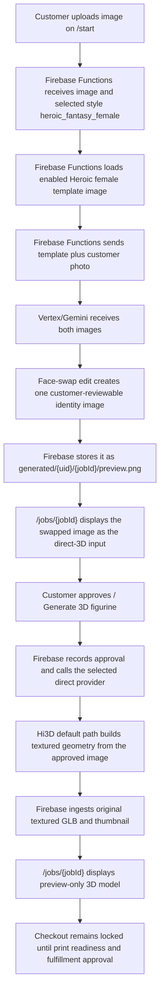

# Heroic Fantasy Female Face Swap Direct 3D Workflow

This document duplicates the Heroic fantasy male direct-3D path for the female style. The customer reviews the face-swapped template image itself, approves it, and the selected direct Multi-Image-to-3D provider builds the textured 3D figurine from that single image. See [Heroic Fantasy Male Face Swap Direct 3D Workflow](./heroic-fantasy-male-face-swap-direct-3d-workflow.md) for the full flow, system responsibilities, job-state details, and provider notes.

The female variant differs from the male workflow by style ID, public label, and the enabled template image.

## Short Version

- Style ID: `heroic_fantasy_female`
- Public label: `Heroic fantasy female`
- Product type: `figurine`
- Proof mode: `template_face_swap`
- 3D workflow: `direct_multi_image_to_3d`
- Default provider / model: `hi3d` / `hitem3dv2.1`
- Rollback provider / model: `meshy` / `meshy-6`
- Local seed reference image: `C:\Users\Eliud\Desktop\Styles\Heroic Female.png`
- Seeded Storage reference path: `admin/workflow-style-references/heroic_fantasy_female/heroic-female-template.png`
- Customer upload page: `/start`
- Customer review page: `/jobs/{jobId}`
- Vertex/Gemini output: one face-swapped identity image
- Direct provider output: original textured GLB preview
- Checkout: locked until print-readiness and fulfillment approval

## End-To-End Flow



## Template Setup

The seed script is:

```bash
npm --workspace apps/functions run seed:heroic-female-workflow
```

The script reads `C:\Users\Eliud\Desktop\Styles\Heroic Female.png` (pass `--source <path>` to override), uploads it to `admin/workflow-style-references/heroic_fantasy_female/heroic-female-template.png`, and upserts this style in `adminConfig/figurineWorkflow`:

```json
{
  "id": "heroic_fantasy_female",
  "label": "Heroic fantasy female",
  "productType": "figurine",
  "proofMode": "template_face_swap",
  "generationWorkflow": "direct_multi_image_to_3d",
  "provider": "hi3d",
  "providerModel": "hitem3dv2.1",
  "enabled": true,
  "referenceImages": [
    {
      "id": "heroic-female-template",
      "label": "Heroic Female",
      "storagePath": "admin/workflow-style-references/heroic_fantasy_female/heroic-female-template.png",
      "mimeType": "image/png",
      "enabled": true
    }
  ]
}
```

The style prompt is the standard verbatim template-face-swap prompt (`defaultTemplateFaceSwapPrompt`): the template controls pose, costume, colors, lighting, and framing; only the face/head identity comes from the customer photo. `template_face_swap` requires at least one enabled reference image. If the template is missing, proof generation fails before any 3D provider is called.

## What Each System Does

Identical to the Heroic fantasy male path except for style fields, labels, and reference image:

```json
{
  "selectedStyle": "heroic_fantasy_female",
  "selectedStyleLabel": "Heroic fantasy female",
  "generated3dWorkflow": "direct_multi_image_to_3d",
  "generated3dProvider": "hi3d",
  "generated3dProviderModel": "hitem3dv2.1",
  "conceptSource": "direct_multi_image_to_3d_input",
  "generatedImages": [
    {
      "id": "direct-3d-input-1",
      "label": "Heroic fantasy female direct-3D input",
      "storagePath": "generated/{uid}/{jobId}/preview.png",
      "status": "ready",
      "isPlaceholder": false
    }
  ]
}
```

Post-approval shape matches the Heroic fantasy male document: approval stores `approvedImagePath`, dispatches the selected direct provider/model, ingests the original textured GLB under the provider-specific figurine preview path, sets `figurinePreview.status: "preview_ready"`, and keeps `figurinePreview.printReadiness: "needs_review"`.

## Current Trace Status

No completed Heroic fantasy female production job trace is recorded yet. After the first successful run, add the concrete job ID, UID, generated paths, provider task ID, and local mirrored metadata path here, following the trace format in `docs/Workflows/chibi-face-swap-creative-lab-workflow.md`.

## Source Pointers

- Full flow and provider notes: `docs/Workflows/heroic-fantasy-male-face-swap-direct-3d-workflow.md`
- Workflow config and provider catalog: `apps/functions/src/figurineWorkflowConfig.ts`
- Seed script: `apps/functions/scripts/seed-heroic-female-workflow.mjs`
- Vertex/Gemini face-swap routing: `apps/functions/src/aiProvider.ts`
- Direct-3D input branch (`conceptSource: direct_multi_image_to_3d_input`): `apps/functions/src/index.ts`
- Hi3D provider adapter: `apps/functions/src/hi3dFigurineProvider.ts`
- Meshy direct rollback adapter: `apps/functions/src/meshyFigurineProvider.ts`
- Customer upload UI: `apps/web/components/UploadFlow.tsx`
- Customer review UI: `apps/web/components/JobDetail.tsx`
- Overview doc: `docs/Workflows/figurine-and-operator-workflows.md`
