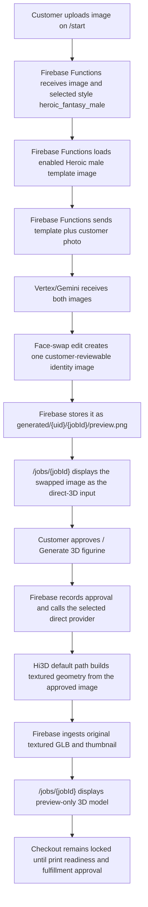

# Heroic Fantasy Male Face Swap Direct 3D Workflow

This document explains the Heroic fantasy male workflow. It is a template-face-swap style that uses the customer's photo only for face/head identity, then sends the approved swapped image directly to the selected Multi-Image-to-3D provider. There is no Meshy Creative Lab concept gate: the customer reviews the face-swapped template image itself, approves it, and the direct provider builds the textured 3D figurine from that single image.

## Short Version

- Style ID: `heroic_fantasy_male`
- Public label: `Heroic fantasy male`
- Product type: `figurine`
- Proof mode: `template_face_swap`
- 3D workflow: `direct_multi_image_to_3d`
- Default provider / model: `hi3d` / `hitem3dv2.1`
- Rollback provider / model: `meshy` / `meshy-6`
- Local seed reference image: `C:\Users\Eliud\Desktop\Styles\Heroic Male.png`
- Seeded Storage reference path: `admin/workflow-style-references/heroic_fantasy_male/heroic-male-template.png`
- Customer upload page: `/start`
- Customer review page: `/jobs/{jobId}`
- Vertex/Gemini output: one face-swapped identity image
- Direct provider output: original textured GLB preview
- Checkout: locked until print-readiness and fulfillment approval

## End-To-End Flow



## Template Setup

The seed script is:

```bash
npm --workspace apps/functions run seed:heroic-workflow
```

Dry run:

```bash
npm --workspace apps/functions run seed:heroic-workflow -- --dry-run
```

The script reads `C:\Users\Eliud\Desktop\Styles\Heroic Male.png`, uploads it to `admin/workflow-style-references/heroic_fantasy_male/heroic-male-template.png`, and upserts this style in `adminConfig/figurineWorkflow`:

```json
{
  "id": "heroic_fantasy_male",
  "label": "Heroic fantasy male",
  "productType": "figurine",
  "proofMode": "template_face_swap",
  "generationWorkflow": "direct_multi_image_to_3d",
  "provider": "hi3d",
  "providerModel": "hitem3dv2.1",
  "enabled": true,
  "referenceImages": [
    {
      "id": "heroic-male-template",
      "label": "Heroic Male",
      "storagePath": "admin/workflow-style-references/heroic_fantasy_male/heroic-male-template.png",
      "mimeType": "image/png",
      "enabled": true
    }
  ]
}
```

The style prompt is the standard verbatim template-face-swap prompt (`defaultTemplateFaceSwapPrompt`): the template controls pose, costume, colors, lighting, and framing; only the face/head identity comes from the customer photo. `template_face_swap` requires at least one enabled reference image. If the template is missing, proof generation fails before any 3D provider is called.

## What Each System Does

| System | Responsibility | Output |
| --- | --- | --- |
| Customer | Uploads a source photo and selects Heroic fantasy male on `/start`. | Uploaded customer image in Storage. |
| Firebase Functions | Creates the job, reads workflow config, loads the enabled Heroic male template image, and calls Vertex/Gemini in `template_face_swap` mode. | One face-swapped identity image, usually `generated/{uid}/{jobId}/preview.png`. |
| Vertex/Gemini | Edits the Heroic male template so the head/face identity comes from the customer photo while the template controls style, pose, costume, and figure design. | One new identity image. |
| Firebase Functions | Stores the swapped image as the reviewable direct-3D input (`conceptSource: direct_multi_image_to_3d_input`). No Creative Lab prototype is called. | Job in `preview_ready` with one reviewable image. |
| Customer | Reviews the swapped image on `/jobs/{jobId}` before any direct-3D credits are spent. | Approval action. |
| Firebase Functions | Records approval and routes to the job-stamped direct provider/model. Current default is Hi3D `hitem3dv2.1`; Meshy `meshy-6` remains the no-deploy rollback. | Direct provider task records and ingested 3D assets. |
| Hi3D default path | Builds textured 3D geometry from the single approved image. | Original textured `model.glb` and thumbnail when returned. |
| Firebase Storage / job page | Stores and displays the original textured GLB preview under the provider-specific figurine preview prefix. | Preview-only 3D model on `/jobs/{jobId}`. |

## Job State Shape

Before customer approval, the Heroic fantasy male path should look like this:

```json
{
  "selectedStyle": "heroic_fantasy_male",
  "selectedStyleLabel": "Heroic fantasy male",
  "productType": "figurine",
  "generated3dWorkflow": "direct_multi_image_to_3d",
  "generated3dProvider": "hi3d",
  "generated3dProviderModel": "hitem3dv2.1",
  "conceptSource": "direct_multi_image_to_3d_input",
  "generatedImages": [
    {
      "id": "direct-3d-input-1",
      "label": "Heroic fantasy male direct-3D input",
      "storagePath": "generated/{uid}/{jobId}/preview.png",
      "status": "ready",
      "isPlaceholder": false
    }
  ]
}
```

There is no `figurineConcept` object on this path. That object belongs to the Meshy Creative Lab concept-gate flows.

After customer approval and the direct provider build, the job should also have:

```json
{
  "status": "approved",
  "conceptSource": "approved_2d_proof",
  "approvedImagePath": "generated/{uid}/{jobId}/preview.png",
  "figurineGeneration": {
    "provider": "hi3d",
    "workflow": "direct_multi_image_to_3d",
    "modelTaskId": "{providerTaskId}",
    "availableFormats": ["glb"]
  },
  "figurinePreview": {
    "status": "preview_ready",
    "previewGlb": "print-files/{uid}/{jobId}/figurine/hi3d-direct-original/model.glb",
    "thumbnail": "print-files/{uid}/{jobId}/figurine/hi3d-direct-original/thumbnail.png",
    "printReadiness": "needs_review"
  },
  "checkoutEligibility": {
    "eligible": false,
    "reason": "Figurine checkout is locked until printability and slicer review are complete."
  }
}
```

## Provider Notes

- Hi3D API root: `https://api.hitem3d.ai/open-api/v1`.
- Default model: `hitem3dv2.1` at `1536fast`, geometry + texture, GLB canonical output, about 25 credits and about 7 minutes per generation.
- Admins can choose `scene-portraitv2.1` or switch the style to Meshy `meshy-6` from `/admin` without a deploy.
- The job stamps `generated3dProvider` and `generated3dProviderModel` when created, and `approveGeneratedImage` routes from those stamped values.
- The older Meshy direct path used `/openapi/v1/multi-image-to-3d`, `meshy-6`, texture on, PBR off, remesh on, and `glb/stl/3mf` target formats. Treat that as rollback/history unless the workflow config selects Meshy.

## Current Trace Status

No completed Heroic fantasy male production job trace is recorded yet in this document. After the next successful run, add the concrete job ID, UID, generated paths, provider task ID, and local mirrored metadata path here, following the trace format in `docs/Workflows/chibi-face-swap-creative-lab-workflow.md`.

## Source Pointers

- Workflow config and provider catalog: `apps/functions/src/figurineWorkflowConfig.ts`
- Seed script: `apps/functions/scripts/seed-heroic-workflow.mjs`
- Vertex/Gemini face-swap routing: `apps/functions/src/aiProvider.ts`
- Direct-3D input branch (`conceptSource: direct_multi_image_to_3d_input`): `apps/functions/src/index.ts`
- Hi3D provider adapter: `apps/functions/src/hi3dFigurineProvider.ts`
- Meshy direct rollback adapter: `apps/functions/src/meshyFigurineProvider.ts`
- Customer upload UI: `apps/web/components/UploadFlow.tsx`
- Customer review UI: `apps/web/components/JobDetail.tsx`
- Female variant: `docs/Workflows/heroic-fantasy-female-face-swap-direct-3d-workflow.md`
- Overview doc: `docs/Workflows/figurine-and-operator-workflows.md`
