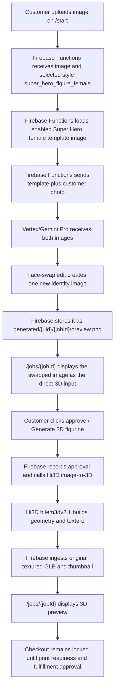

# Super Hero Female Face Swap Direct 3D Workflow

This document duplicates the Super Hero male face-swap direct-3D path for the female style. The customer reviews the face-swapped template image (the "direct-3D input"), approves it, and Hi3D builds the textured 3D figurine from that single image. See [Super Hero Male Face Swap Direct 3D Workflow](./superhero-male-face-swap-direct-3d-workflow.md) for the full flow, system responsibilities, job-state details, and provider notes.

The female variant differs from the male workflow by style ID, public label, and the template image — and unlike the male's admin-uploaded template, the female template was generated with Vertex `gemini-3-pro-image` (2026-07-08) using the male template as a style/framing reference: a "hero mom" character (auburn bob, deep red supersuit, black gloves/boots/belt, orange "SM" chest monogram, arms-crossed confident pose, gray studio background, no mask so the face swap has a full face to work with).

## Short Version

- Style ID: `super_hero_figure_female`
- Public label: `Super Hero Figure - Female`
- Product type: `figurine`
- Proof mode: `template_face_swap`
- 3D workflow: `direct_multi_image_to_3d`
- Provider / model: `hi3d` / `hitem3dv2.1` (1536³ Fast, 25 credits ≈ $0.50, ~7 min)
- Local seed reference image: `C:\Users\Eliud\Desktop\Styles\Super Hero Female.png`
- Seeded Storage reference path: `admin/workflow-style-references/super_hero_figure_female/superhero-female-template.png`
- Rejected template candidates archive: `E:\PROJECTS\3DPrintPosters\.tmp\superhero-female-refs\`
- Customer upload page: `/start`
- Customer review page: `/jobs/{jobId}`
- Vertex/Gemini output: one face-swapped identity image (customer-reviewable)
- Hi3D output: original textured GLB preview
- Checkout: locked until print-readiness and fulfillment approval

## End-To-End Flow



## Reference Image Setup

The seed script for this workflow is:

```bash
npm --workspace apps/functions run seed:superhero-female-workflow
```

For a no-write check:

```bash
npm --workspace apps/functions run seed:superhero-female-workflow:dry-run
```

The script reads `C:\Users\Eliud\Desktop\Styles\Super Hero Female.png` (pass `--source <path>` to override), uploads it to `admin/workflow-style-references/super_hero_figure_female/superhero-female-template.png`, and upserts this style in `adminConfig/figurineWorkflow`:

```json
{
  "id": "super_hero_figure_female",
  "label": "Super Hero Figure - Female",
  "productType": "figurine",
  "proofMode": "template_face_swap",
  "generationWorkflow": "direct_multi_image_to_3d",
  "provider": "hi3d",
  "providerModel": "hitem3dv2.1",
  "enabled": true,
  "referenceImages": [
    {
      "id": "superhero-female-template",
      "label": "Super Hero Female",
      "storagePath": "admin/workflow-style-references/super_hero_figure_female/superhero-female-template.png",
      "mimeType": "image/png",
      "enabled": true
    }
  ]
}
```

The style prompt is the standard verbatim template-face-swap prompt. `template_face_swap` requires at least one enabled reference image — if the style exists without the seeded template, proof generation fails before Hi3D is called.

## Job State Shape

Identical to the Super Hero male path except for the style fields and labels. Before approval:

```json
{
  "selectedStyle": "super_hero_figure_female",
  "selectedStyleLabel": "Super Hero Figure - Female",
  "productType": "figurine",
  "generated3dWorkflow": "direct_multi_image_to_3d",
  "generated3dProvider": "hi3d",
  "generated3dProviderModel": "hitem3dv2.1",
  "conceptSource": "direct_multi_image_to_3d_input",
  "generatedImages": [
    {
      "id": "direct-3d-input-1",
      "label": "Super Hero Figure - Female direct-3D input",
      "storagePath": "generated/{uid}/{jobId}/preview.png",
      "status": "ready",
      "isPlaceholder": false
    }
  ]
}
```

There is no `figurineConcept` object on this path. The post-approval shape matches the Super Hero male document (Hi3D build under `print-files/{uid}/{jobId}/figurine/hi3d-direct-original/`).

## Template Provenance

The template was created 2026-07-08 because no female counterpart photo existed to face swap:

1. The male template was downloaded from Storage and passed to Vertex `gemini-3-pro-image` as a style/framing reference (2K, 1:1, head-to-feet no-crop clause).
2. Elliot rejected the first blue/orange "SD" counterpart in favor of an Incredibles-inspired "hero mom" direction; three poses were generated, then regenerated with an "SM" oval chest emblem.
3. Elliot picked the arms-crossed v2 variant as the production template.

All candidates (including the rejected SD-costume original) are archived in `.tmp/superhero-female-refs/`. Prompt-safety note for regenerating: female-character prompts with "thigh-high boots" or hip/thigh body-shape wording trip Vertex's `IMAGE_PROHIBITED_CONTENT` filter — use "modest full-body supersuit covering neck to ankles" phrasing instead, and run parallel 2K requests sequentially (the key 429s immediately).

## Current Trace Status

No completed Super Hero female production job trace is recorded yet. After the first successful run, add the concrete job ID, UID, generated paths, Hi3D task ID, and local mirrored metadata path here, following the trace format in `docs/Workflows/chibi-face-swap-creative-lab-workflow.md`.

## Source Pointers

- Full flow and provider notes: `docs/Workflows/superhero-male-face-swap-direct-3d-workflow.md`
- Workflow config and provider catalog: `apps/functions/src/figurineWorkflowConfig.ts`
- Seed script: `apps/functions/scripts/seed-superhero-female-workflow.mjs`
- Vertex/Gemini face-swap routing: `apps/functions/src/aiProvider.ts`
- Direct-3D input branch: `apps/functions/src/index.ts`
- Hi3D provider adapter: `apps/functions/src/hi3dFigurineProvider.ts`
- Customer upload UI: `apps/web/components/UploadFlow.tsx`
- Customer review UI: `apps/web/components/JobDetail.tsx`
- Overview doc: `docs/Workflows/figurine-and-operator-workflows.md`
