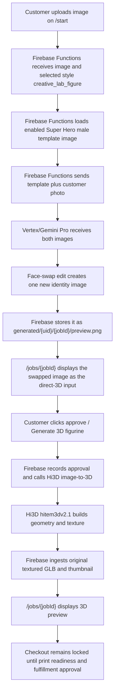

# Super Hero Male Face Swap Direct 3D Workflow

This document explains the Super Hero Figure - Male workflow. It is a template-face-swap style like the chibi face-swap paths, but the 3D side is direct Multi-Image-to-3D on Hi3D (Hitem3D), not Meshy Creative Lab. There is no Meshy concept gate: the customer reviews the face-swapped template image itself (the "direct-3D input"), approves it, and Hi3D builds the textured 3D figurine from that single image.

The style keeps the historical style ID `creative_lab_figure` (it began life as the default Creative Lab style and was repurposed and renamed in `/admin`). The ID is load-bearing in job records and `isFigurineStyle`; only the label, prompt, template, and provider fields were changed.

## Short Version

- Style ID: `creative_lab_figure` (historical; do not rename)
- Public label: `Super Hero Figure - Male`
- Product type: `figurine`
- Proof mode: `template_face_swap`
- 3D workflow: `direct_multi_image_to_3d`
- Provider / model: `hi3d` / `hitem3dv2.1` (1536³ Fast, 25 credits ≈ $0.50, ~7 min)
- Template image: `admin/workflow-style-references/creative_lab_figure/2976aa57-ae7d-4d8b-9ac9-6b9c33271c56.png` (blue/orange "SD" superhero, admin-uploaded via `/admin`)
- Customer upload page: `/start`
- Customer review page: `/jobs/{jobId}`
- Vertex/Gemini output: one face-swapped identity image (customer-reviewable)
- Hi3D output: original textured GLB preview
- Checkout: locked until print-readiness and fulfillment approval

## End-To-End Flow



## Template Setup

The male style is admin-managed: the template was uploaded through the `/admin` Workflow controls (no seed script). The style record in `adminConfig/figurineWorkflow` looks like this:

```json
{
  "id": "creative_lab_figure",
  "label": "Super Hero Figure - Male",
  "productType": "figurine",
  "proofMode": "template_face_swap",
  "generationWorkflow": "direct_multi_image_to_3d",
  "provider": "hi3d",
  "providerModel": "hitem3dv2.1",
  "enabled": true,
  "referenceImages": [
    {
      "id": "2976aa57-ae7d-4d8b-9ac9-6b9c33271c56",
      "label": "Reference 1",
      "storagePath": "admin/workflow-style-references/creative_lab_figure/2976aa57-ae7d-4d8b-9ac9-6b9c33271c56.png",
      "mimeType": "image/png",
      "enabled": true
    }
  ]
}
```

The style prompt is the standard verbatim template-face-swap prompt (`defaultTemplateFaceSwapPrompt`): the template controls pose, costume, colors, lighting, and framing; only the face/head identity comes from the customer photo. `template_face_swap` requires at least one enabled reference image — if the template is missing, proof generation fails before any 3D provider is called.

## What Each System Does

| System                      | Responsibility                                                                                                                                                  | Output                                                                          |
| --------------------------- | ----------------------------------------------------------------------------------------------------------------------------------------------------------------- | -------------------------------------------------------------------------------- |
| Customer                    | Uploads a source photo and selects Super Hero Figure - Male on `/start`.                                                                                        | Uploaded customer image in Storage.                                             |
| Firebase Functions          | Creates the job, reads workflow config, loads the enabled template image, and calls Vertex/Gemini in `template_face_swap` mode.                                 | One face-swapped identity image, usually `generated/{uid}/{jobId}/preview.png`. |
| Vertex/Gemini Pro           | Edits the Super Hero template so the head/face identity comes from the customer photo while the template controls style, pose, costume, and figure design.      | One new identity image.                                                         |
| Firebase Functions          | Stores the swapped image as the reviewable direct-3D input (`conceptSource: direct_multi_image_to_3d_input`). No Meshy prototype is called.                     | Job in `preview_ready` with one reviewable image.                               |
| Customer                    | Reviews the swapped image on `/jobs/{jobId}` before any 3D credits are spent.                                                                                   | Approval action.                                                                |
| Firebase Functions          | Records the approval and calls Hi3D image-to-3D with the approved image (`generateHi3dDirectImageFigurinePreview`, model `hitem3dv2.1`).                        | Hi3D task records and ingested 3D assets.                                       |
| Hi3D (Hitem3D)              | Builds textured 3D geometry from the single approved image. 1536³ Fast, geometry + texture, no PBR, ~7 minutes, 25 credits.                                     | Original textured `model.glb` (and thumbnail when returned).                    |
| Firebase Storage / job page | Stores and displays the original textured GLB preview under `print-files/{uid}/{jobId}/figurine/hi3d-direct-original/`.                                         | Preview-only 3D model on `/jobs/{jobId}`.                                       |

## Job State Shape

Before customer approval, the Super Hero male path should look like this:

```json
{
  "selectedStyle": "creative_lab_figure",
  "selectedStyleLabel": "Super Hero Figure - Male",
  "productType": "figurine",
  "generated3dWorkflow": "direct_multi_image_to_3d",
  "generated3dProvider": "hi3d",
  "generated3dProviderModel": "hitem3dv2.1",
  "conceptSource": "direct_multi_image_to_3d_input",
  "generatedImages": [
    {
      "id": "direct-3d-input-1",
      "label": "Super Hero Figure - Male direct-3D input",
      "storagePath": "generated/{uid}/{jobId}/preview.png",
      "status": "ready",
      "isPlaceholder": false
    }
  ]
}
```

There is no `figurineConcept` object on this path — that belongs to the Creative Lab concept-gate flows.

After customer approval and the Hi3D build, the job should also have:

```json
{
  "status": "approved",
  "conceptSource": "approved_2d_proof",
  "approvedImagePath": "generated/{uid}/{jobId}/preview.png",
  "figurineGeneration": {
    "provider": "hi3d",
    "workflow": "direct_multi_image_to_3d",
    "modelTaskId": "{hi3dTaskId}",
    "availableFormats": ["glb"]
  },
  "figurinePreview": {
    "status": "preview_ready",
    "previewGlb": "print-files/{uid}/{jobId}/figurine/hi3d-direct-original/model.glb",
    "thumbnail": "print-files/{uid}/{jobId}/figurine/hi3d-direct-original/thumbnail.png",
    "printReadiness": "needs_review"
  },
  "checkoutEligibility": {
    "eligible": false,
    "reason": "Figurine checkout is locked until printability and slicer review are complete."
  }
}
```

## Provider Notes

- Hi3D API root: `https://api.hitem3d.ai/open-api/v1` (Basic-auth token exchange with `HI3D_ACCESS_KEY` / `HI3D_SECRET_KEY`).
- `hitem3dv2.1` runs at resolution `1536fast`; the admin dropdown alternative `scene-portraitv2.1` runs at `1536profast` (same 25-credit price, face-quality winner in the 2026-07-08 comparison). Admins select the model per style in `/admin`.
- Meshy Multi-Image-to-3D remains selectable as the rollback provider for direct styles.
- The `approveGeneratedImage` callable allows up to 1200 s for direct builds (~7-8 min Hi3D wall time plus asset transfer).

## Current Trace Status

No completed Super Hero male production job trace is recorded yet in this document. After the next successful run, add the concrete job ID, UID, generated paths, Hi3D task ID, and local mirrored metadata path here, following the trace format in `docs/Workflows/chibi-face-swap-creative-lab-workflow.md`.

## Source Pointers

- Workflow config and provider catalog: `apps/functions/src/figurineWorkflowConfig.ts`
- Vertex/Gemini face-swap routing: `apps/functions/src/aiProvider.ts`
- Direct-3D input branch (`conceptSource: direct_multi_image_to_3d_input`): `apps/functions/src/index.ts`
- Hi3D provider adapter: `apps/functions/src/hi3dFigurineProvider.ts`
- Customer upload UI: `apps/web/components/UploadFlow.tsx`
- Customer review UI: `apps/web/components/JobDetail.tsx`
- Female variant: `docs/Workflows/superhero-female-face-swap-direct-3d-workflow.md`
- Overview doc: `docs/Workflows/figurine-and-operator-workflows.md`
