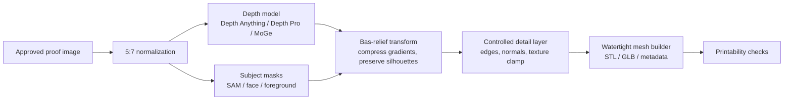

# Heightmap And 3D Workflow Research

Date: 2026-05-09

2026-05-23 status update: this research remains valid for the parked 5x7 poster-relief product line. Its "full image-to-3D is rejected" conclusion applies to poster relief only. The business priority has shifted to proving a PrintU-like standalone figurine workflow, where image-to-3D providers such as Meshy.ai may be the right tool rather than the wrong one.

## Executive Summary

The current heightmap problem is not surprising. The print-file generator is using a deliberately simple `posterized_luminance` provider: grayscale conversion, blur, autocontrast, 9 height bands, a small edge-detail pass, then direct heightfield meshing. That makes a valid printable relief, but it also explains the chunky gray regions and muddy face detail visible in the local screenshots.

The best next workflow is not to jump straight from the approved proof to a full image-to-3D asset model. The better near-term path is:

1. Replace or supplement luminance heightmaps with semantic depth maps.
2. Convert the semantic depth map into a bas-relief heightfield using gradient compression, subject masks, and controlled detail layers.
3. Keep final STL/GLB generation deterministic and server-side in `services/print-file-generator`.
4. Run SAM 3D, TRELLIS, Stable Fast 3D, TripoSR, and TriplaneGaussian as sidecar experiments, scored against printability and relief usefulness.

In plain terms: better heightmaps need better depth plus better bas-relief processing. Full 3D generators are useful research, but they are not the first fix for the current poster relief.

## Current Heightmap Diagnosis

Current code path:

- `services/print-file-generator/app/depth.py`
- Provider name: `posterized_luminance`
- Height bands: `POSTER_RELIEF_BANDS = 9`
- Base blur: `BASE_SMOOTH_RADIUS_PX = 2.0`
- Terrace blur: `TERRACE_SMOOTH_RADIUS_PX = 0.7`
- Edge weight: `EDGE_DETAIL_WEIGHT = 0.18`
- Mesh resolution default: `target_width_px = 160`

Why the screenshots look wrong:

- Luminance is not depth. Dark hair, dark shirts, shadows, and background gradients become geometry, even when they do not represent spatial depth.
- Posterization to 9 bands intentionally creates terracing. That can look stylized, but faces quickly become blobs.
- The current pipeline blurs before height conversion, which suppresses texture noise but also removes facial shape.
- The output heightmap is 8-bit PNG, fine for preview/download, but internal bas-relief processing should stay float/16-bit as long as possible to avoid stair-stepping.
- The mesh resolution is intentionally modest. At 127 mm wide and 160 columns, each sample is about 0.8 mm apart. That is printable, but too coarse for fine portrait relief unless we add adaptive subdivision or higher-resolution top surfaces.

Immediate conclusion: keep the existing provider as a deterministic fallback, but do not treat it as the "real" production depth provider.

## What A Better Heightmap Pipeline Should Do

Recommended revised pipeline:



Key implementation ideas:

- Use semantic depth as the base layer, not raw brightness.
- Use foreground/background masks so the subject can be raised while noisy backgrounds stay shallow.
- Use gradient compression rather than linear depth scaling. This is the classic bas-relief trick: preserve readable local details while fitting everything into a shallow physical depth.
- Use a separate high-frequency detail layer from edges/normals, but cap it tightly so text and hair do not become sharp printable noise.
- Keep all internal height data as `float32`; export preview `heightmap.png` as 8-bit or 16-bit depending on downstream need.
- Increase top-surface resolution only when printability and STL size stay within bounds. Consider adaptive subdivision rather than uniformly increasing every job.

## Repos Worth Studying For Heightmap And Relief

### Heightmap2STL

- Repo: [41pha1/Heightmap2STL](https://github.com/41pha1/Heightmap2STL)
- Why it matters: It converts grayscale heightmaps to printable STL and uses dynamic subdivision instead of a fixed grid.
- Useful idea for us: adaptive mesh density. We can keep smooth regions light while preserving facial and typography edges.
- Caveat: It is terrain-oriented, not portrait bas-relief oriented. Treat as reference code, not a direct dependency.

### digital-bas-relief

- Repo: [wingated/digital-bas-relief](https://github.com/wingated/digital-bas-relief)
- Why it matters: It implements a depth-image-to-bas-relief transform based on the "Digital Bas-Relief from 3D Scenes" family of methods.
- Useful idea for us: gradient compression plus reconstruction is more appropriate than simply scaling depth into 0.4-3.0 mm.
- Caveat: It expects an existing depth map; it does not solve monocular depth by itself.

### ModelRelief

- Site: [ModelRelief](https://modelrelief.org/home/about)
- Why it matters: It describes the right conceptual workflow: transform a depth buffer/height map in image space by reducing slopes and amplifying details, then generate the relief mesh.
- Useful idea for us: depth compression should be image-domain processing between depth estimation and STL generation.
- Caveat: It starts from 3D models/scenes, not arbitrary customer photos.

### LithoMaker

- Repo: [muldjord/lithomaker](https://github.com/muldjord/lithomaker)
- Why it matters: It is a local open-source image-to-STL lithophane generator.
- Useful idea for us: practical mesh generation, privacy-oriented local processing, slicer-friendly STL output.
- Caveat: Lithophanes are backlit thickness maps. Our product is front-viewed bas-relief, so inversion, contrast, and material assumptions differ.

### Python lithophane package

- Package: [lithophane on PyPI](https://pypi.org/project/lithophane/)
- Why it matters: Small Python reference for image-to-point-cloud-to-STL flow.
- Useful idea for us: simple tests and fixtures around image-to-STL conversion.
- Caveat: It is not enough for production portrait relief quality.

## Candidate 3D And AI Models

### Meta SAM 3D Objects

- GitHub: [facebookresearch/sam-3d-objects](https://github.com/facebookresearch/sam-3d-objects)
- Hugging Face: [facebook/sam-3d-objects](https://huggingface.co/facebook/sam-3d-objects)
- Paper: [SAM 3D: 3Dfy Anything in Images](https://arxiv.org/abs/2511.16624)
- Fit: Medium-high as a subject/object understanding sidecar.

SAM 3D Objects reconstructs object shape, texture, and layout from a single image or mask. For this project, its most interesting use is not "replace the relief generator." Its most interesting use is:

- segment and reconstruct a main object from clutter,
- produce object-aware masks,
- create an optional raised hero-object variant,
- help separate subject depth from background depth.

Risks:

- Hugging Face model is gated and uses a non-standard/custom license.
- Output examples emphasize Gaussian splats/PLY and object reconstruction, not watertight printable bas-relief.
- For portraits, SAM 3D Body may be more relevant than SAM 3D Objects.

Recommendation: Deep-dive, but keep outside checkout path until licensing, runtime, and mesh export are proven.

### Meta SAM 3D Body

- GitHub: [facebookresearch/sam-3d-body](https://github.com/facebookresearch/sam-3d-body)
- Hugging Face: [facebook/sam-3d-body-dinov3](https://huggingface.co/facebook/sam-3d-body-dinov3)
- Fit: High for human portrait understanding, medium for final relief.

SAM 3D Body is more directly relevant to user-uploaded people than SAM 3D Objects. It can estimate human body/shape from one image. For our portrait examples, it may help preserve facial/head/shoulder structure better than generic depth.

Risks:

- Gated/custom license.
- It is human-specific.
- It may produce body meshes that still need projection, flattening, cleanup, and relief conversion.

Recommendation: Evaluate after a depth-map baseline exists. Use it to generate a portrait-aware mask/depth prior, not as the final STL generator.

### TRELLIS

- GitHub: [microsoft/TRELLIS](https://github.com/microsoft/TRELLIS)
- Hugging Face: [microsoft/TRELLIS-image-large](https://huggingface.co/microsoft/TRELLIS-image-large)
- Paper: [Structured 3D Latents for Scalable and Versatile 3D Generation](https://arxiv.org/abs/2412.01506)
- Fit: Medium as a full 3D asset experiment.

TRELLIS is a strong image-to-3D option with MIT-licensed Hugging Face weights. It is useful for experiments where we turn a subject into a full 3D asset, then project or flatten that asset into a poster relief.

Risks:

- It generates 3D assets, not manufacturing-ready 5x7 relief plates.
- Full asset reconstruction may hallucinate backs/sides that are irrelevant to the product.
- Runtime and GPU requirements need benchmark confirmation in our Cloud Run target.

Recommendation: Good first full-3D side experiment because the license is favorable and the ecosystem is active.

### TRELLIS.2

- Hugging Face: [microsoft/TRELLIS.2-4B](https://huggingface.co/microsoft/TRELLIS.2-4B)
- Paper tag: [arXiv 2512.14692](https://arxiv.org/abs/2512.14692)
- Fit: Research watchlist.

TRELLIS.2 appears newer and larger, with a 4B model on Hugging Face and MIT license metadata. It is attractive for a deep-dive benchmark, but it is probably too heavy to treat as the first production candidate.

Recommendation: Track and benchmark later. Start with TRELLIS-image-large if we want a practical open-source TRELLIS experiment.

### VAST-AI / TriplaneGaussian

- GitHub: [VAST-AI-Research/TriplaneGaussian](https://github.com/VAST-AI-Research/TriplaneGaussian)
- Hugging Face: [VAST-AI/TriplaneGaussian](https://huggingface.co/VAST-AI/TriplaneGaussian)
- Paper: [Triplane Meets Gaussian Splatting](https://arxiv.org/abs/2312.09147)
- Fit: Medium-low for the current workflow.

TriplaneGaussian is interesting because it reconstructs from a single image quickly using a hybrid triplane/Gaussian representation. The Hugging Face model metadata shows Apache-2.0, which is appealing.

Risks:

- Gaussian splat output is not a print file.
- It adds conversion work before we get STL/GLB relief.
- It is older than TRELLIS and Stable Fast 3D.

Recommendation: Keep as a research baseline, especially because licensing looks friendly. Do not prioritize ahead of semantic depth or Stable Fast 3D.

### TripoSR

- GitHub: [VAST-AI-Research/TripoSR](https://github.com/VAST-AI-Research/TripoSR)
- Hugging Face: [stabilityai/TripoSR](https://huggingface.co/stabilityai/TripoSR)
- Paper: [TripoSR technical report](https://arxiv.org/abs/2403.02151)
- Fit: Medium as a lightweight full-3D baseline.

TripoSR is fast, MIT licensed, and practical. The official GitHub README states the default path takes about 6GB VRAM for one image, and the model outputs reconstructed 3D assets quickly.

Risks:

- Quality is older/lower than newer models.
- It reconstructs objects, not controlled bas-relief.
- It may struggle with full portrait posters and AI-generated graphic layouts.

**Experiment 5 result (2026-05-09): NOT VIABLE for poster relief.** Tested via Tripo AI API (v2.5-20250123) against both canonical inputs. Full image-to-3D reconstruction is fundamentally the wrong tool — it builds a standalone 3D object (e.g. a figurine) rather than estimating depth within the image frame. The heightmaps show unrecognizable silhouettes with no correspondence to the input photos. Monocular depth estimators (Experiments 2–4) solve the correct problem. This finding likely applies to all Experiment 5 candidates (Stable Fast 3D, TRELLIS, SAM 3D, TriplaneGaussian) since they share the same image-to-3D paradigm.

Recommendation: ~~Excellent "can we run image-to-3D in our service at all?" baseline.~~ **Evaluated and rejected.** Full 3D reconstruction does not produce useful poster relief inputs. Focus on monocular depth + subject masking (Experiments 2–4).

### Stable Fast 3D

- GitHub: [Stability-AI/stable-fast-3d](https://github.com/Stability-AI/stable-fast-3d)
- Hugging Face: [stabilityai/stable-fast-3d](https://huggingface.co/stabilityai/stable-fast-3d)
- Announcement: [Stable Fast 3D](https://stability.ai/news-updates/introducing-stable-fast-3d)
- Fit: Medium-high for optional textured object packages, medium-low for direct relief.

Stable Fast 3D is the most practical Stability AI 3D candidate. It creates UV-unwrapped mesh assets and material parameters from one image quickly, and is built on the TripoSR line.

Risks:

- Hugging Face model is gated.
- License is Stability AI Community License, with commercial terms tied to revenue thresholds.
- It targets game/AR/product assets, not guaranteed watertight relief plates.

Recommendation: Strong sidecar benchmark after TripoSR. Legal/license review before any commercial order path.

### Stable Video 3D / Stable Zero123 Family

- Project: [SV3D](https://sv3d.github.io/)
- Hugging Face: [stabilityai/sv3d](https://huggingface.co/stabilityai/sv3d)
- Fit: Low-medium.

SV3D and Stable Zero123-style models generate novel views or multi-view images from one image. They can help if we want a multi-view reconstruction pipeline, but they are not the shortest path to a better heightmap.

Recommendation: Defer. Stable Fast 3D, TripoSR, and TRELLIS are more direct for this project.

### Nano Banana / Gemini 2.5 Flash Image

- Google announcement: [Gemini 2.5 Flash Image](https://developers.googleblog.com/en/introducing-gemini-2-5-flash-image/)
- Fit: High for proof generation/editing, low for actual geometry.

Nano Banana is a 2D image generation/editing model, not a 3D model generator. It can be useful for:

- creating cleaner proof images,
- enforcing foreground/midground/background separation,
- removing tiny noisy textures before depth estimation,
- generating relief-friendly grayscale/depth-guide images,
- making consistent variants of the same subject.

Recommendation: Use as a proof and preprocessing tool. Do not rely on it to generate STL/GLB geometry.

## Recommended Experiment Order

### Experiment 1: Fix Current Heightmap Without New AI

Goal: improve visible relief quality using local deterministic changes.

Tasks:

- Add non-posterized luminance provider for comparison.
- Add 16-bit heightmap export option.
- Add optional contrast/gamma controls.
- Raise `target_width_px` for preview jobs, with STL size guardrails.
- Add post-heightmap float smoothing after banding, not only pre-blur.
- Add a "no terracing" mode for portraits.

Success criteria:

- Portrait heightmap no longer has obvious 9-zone blobs.
- STL remains under current size and triangle count limits.
- Existing tests still pass with deterministic fixture updates.

### Experiment 2: Depth Anything V2 Small Baseline

Goal: replace luminance with semantic depth while keeping mesh generation deterministic.

Why first:

- Likely easiest open-source depth provider to integrate.
- Small checkpoint has a more permissive license profile than larger Depth Anything variants.
- Output is directly compatible with our heightfield pipeline.

Success criteria:

- Faces look like faces in the heightmap.
- Background is less dominant.
- No new geometry spikes or unprintable hair/text noise.

### Experiment 3: Bas-Relief Transform

Goal: convert depth maps into printable bas-relief maps rather than linearly scaling depth.

Study and prototype:

- [wingated/digital-bas-relief](https://github.com/wingated/digital-bas-relief)
- [ModelRelief](https://modelrelief.org/home/about)
- [Digital Bas-Relief from 3D Scenes](https://people.eecs.berkeley.edu/~sequin/CS285/PAPERS/SIGGRAPH_07/032-weyrich_3D_BasRelief.pdf)

Success criteria:

- The nose, eyes, lips, shoulders, and major object silhouettes remain readable in shallow relief.
- Deep background changes are compressed without flattening local detail.
- The final map fits our 0.4-3.0 mm relief range.

### Experiment 4: Subject Mask Layering

Goal: use segmentation to control which parts of the image are allowed to carry relief.

Candidates:

- SAM-style 2D segmentation first.
- SAM 3D Objects for object-heavy images.
- SAM 3D Body for human portraits.

Success criteria:

- Subject is raised above background.
- Background does not dominate the print.
- Portraits preserve natural face/shoulder structure without harsh cutout edges.

### Experiment 5: Full 3D Sidecar Benchmarks

Goal: decide whether full image-to-3D models can produce useful relief inputs or optional future product packages.

**Result: NOT VIABLE.** TripoSR (via Tripo AI API) tested 2026-05-09. Full image-to-3D reconstructs standalone objects, not image-plane depth — fundamentally wrong for poster relief. Heightmaps show unrecognizable silhouettes. This finding likely disqualifies all remaining candidates in this category. See `.tmp/experiments/experiment_5/README.md` for full analysis.

Benchmark order (original — remaining items deprioritized):

1. ~~TripoSR~~ — **Evaluated, rejected** (2026-05-09)
2. ~~Stable Fast 3D~~ — Likely same problem (same image-to-3D paradigm)
3. ~~TRELLIS-image-large~~ — Likely same problem
4. ~~SAM 3D Objects~~ — Likely same problem
5. ~~TriplaneGaussian~~ — Likely same problem
6. ~~TRELLIS.2~~ — Likely same problem

Scoring:

- Runs in a server-side batch job.
- Accepts our approved proof image.
- Outputs mesh or convertible representation.
- Can be projected/flatted into a 5x7 relief.
- Preserves recognizable people/objects.
- Produces printable geometry after repair.
- License is acceptable for commercial use.
- Inference cost makes sense for a physical poster order.

## Recommended Near-Term Product Decision

Do this next:

1. Keep current luminance provider as fallback and fixture baseline.
2. Add a `depth_provider` abstraction so providers can be selected by config/request.
3. Add a `depth_anything_v2_small` experimental provider.
4. Add a bas-relief postprocessor that can operate on any float depth map.
5. Add a research CLI that writes side-by-side outputs for the same source image:
   - normalized source,
   - raw depth,
   - compressed relief map,
   - printable heightmap PNG,
   - STL,
   - GLB preview,
   - metadata JSON.

Do not do this yet:

- Do not move geometry generation into the browser.
- Do not make SAM 3D/TRELLIS/Stable Fast 3D part of checkout until they pass printability and license review.
- Do not treat Nano Banana as a 3D generator. It belongs in the proof/refinement step.

## Best Shortlist

For our actual product workflow:

| Rank | Candidate | Role | Why |
| --- | --- | --- | --- |
| 1 | Depth Anything V2 Small | First semantic depth provider | Directly fixes luminance-as-depth problem |
| 2 | digital-bas-relief / ModelRelief ideas | Bas-relief transform | Fixes linear depth scaling and shallow-depth detail loss |
| 3 | SAM 2D / SAM 3D Body | Subject masks | Especially helpful for portraits |
| 4 | TripoSR | ~~Lightweight full-3D baseline~~ | **Rejected** — full 3D reconstructs objects, not image-plane depth |
| 5 | Stable Fast 3D | Better asset sidecar | Fast textured mesh, but gated/license review needed |
| 6 | TRELLIS-image-large | Higher-quality open full-3D test | MIT and strong ecosystem |
| 7 | SAM 3D Objects | Object-aware reconstruction | Promising but gated/custom license |
| 8 | TriplaneGaussian | Research baseline | Apache-2.0 HF metadata, but splat-to-print gap |
| 9 | Nano Banana | Proof refinement | Useful 2D preprocessing, not geometry |

## Sources

- [Existing project research](../AI_3D_MODEL_GENERATION_RESEARCH.md)
- [Meta SAM 3D blog](https://ai.meta.com/blog/sam-3d/)
- [facebookresearch/sam-3d-objects](https://github.com/facebookresearch/sam-3d-objects)
- [facebookresearch/sam-3d-body](https://github.com/facebookresearch/sam-3d-body)
- [facebook/sam-3d-objects on Hugging Face](https://huggingface.co/facebook/sam-3d-objects)
- [facebook/sam-3d-body-dinov3 on Hugging Face](https://huggingface.co/facebook/sam-3d-body-dinov3)
- [SAM 3D paper](https://arxiv.org/abs/2511.16624)
- [microsoft/TRELLIS](https://github.com/microsoft/TRELLIS)
- [microsoft/TRELLIS-image-large on Hugging Face](https://huggingface.co/microsoft/TRELLIS-image-large)
- [microsoft/TRELLIS.2-4B on Hugging Face](https://huggingface.co/microsoft/TRELLIS.2-4B)
- [VAST-AI-Research/TriplaneGaussian](https://github.com/VAST-AI-Research/TriplaneGaussian)
- [VAST-AI/TriplaneGaussian on Hugging Face](https://huggingface.co/VAST-AI/TriplaneGaussian)
- [VAST-AI-Research/TripoSR](https://github.com/VAST-AI-Research/TripoSR)
- [stabilityai/TripoSR on Hugging Face](https://huggingface.co/stabilityai/TripoSR)
- [Stable Fast 3D announcement](https://stability.ai/news-updates/introducing-stable-fast-3d)
- [Stability-AI/stable-fast-3d](https://github.com/Stability-AI/stable-fast-3d)
- [stabilityai/stable-fast-3d on Hugging Face](https://huggingface.co/stabilityai/stable-fast-3d)
- [SV3D project page](https://sv3d.github.io/)
- [stabilityai/sv3d on Hugging Face](https://huggingface.co/stabilityai/sv3d)
- [Gemini 2.5 Flash Image announcement](https://developers.googleblog.com/en/introducing-gemini-2-5-flash-image/)
- [41pha1/Heightmap2STL](https://github.com/41pha1/Heightmap2STL)
- [wingated/digital-bas-relief](https://github.com/wingated/digital-bas-relief)
- [ModelRelief](https://modelrelief.org/home/about)
- [muldjord/lithomaker](https://github.com/muldjord/lithomaker)
- [lithophane on PyPI](https://pypi.org/project/lithophane/)

## Experiment Organization Pattern

### Directory Structure (MANDATORY)

All experiment outputs must follow this structure:

```
.tmp/experiments/
├── experiment_1/
│   ├── posterized_luminance/
│   │   ├── Profile-Pic-HIMSS/
│   │   │   ├── heightmap.png
│   │   │   ├── model.stl
│   │   │   ├── preview.glb
│   │   │   ├── metadata.json
│   │   │   └── filament-painting/
│   │   └── Gemini_Generated_Image_lzneejlzneejlzne/
│   ├── continuous_luminance/
│   │   ├── Profile-Pic-HIMSS/
│   │   └── Gemini_Generated_Image_lzneejlzneejlzne/
│   └── lithophane_baseline/
│       ├── Profile-Pic-HIMSS/
│       └── Gemini_Generated_Image_lzneejlzneejlzne/
├── experiment_2/
│   └── depth_anything_v2_small/
│       ├── Profile-Pic-HIMSS/
│       └── Gemini_Generated_Image_lzneejlzneejlzne/
└── experiment_3/
    ├── README.md                           (Summary of results)
    └── depth_anything_v2_small_bas_relief/
        ├── Profile-Pic-HIMSS/
        └── Gemini_Generated_Image_lzneejlzneejlzne/
```

### Key Rules

1. **No loose artifacts in `.tmp/` root** - All STL, PNG, GLB files must be organized under `experiments/experiment_N/`.
2. **Both test images required** - Each provider must be tested on both:
   - `Profile-Pic-HIMSS.jpg` (portrait headshot)
   - `Gemini_Generated_Image_lzneejlzneejlzne.png` (AI-generated graphics)
3. **Summary files inside experiment folder** - Use `experiments/experiment_N/README.md` or `RESULTS.md` for comparison notes.
4. **Auto-routing in scripts** - The `run_heightmap_experiment.py` script auto-selects the correct output folder based on which provider is specified.

### Running Experiments

```powershell
# Experiment 3 example (outputs to experiments/experiment_3/)
python scripts\run_heightmap_experiment.py ..\..\.tmp\input_image\Profile-Pic-HIMSS.jpg --provider depth_anything_v2_small_bas_relief
python scripts\run_heightmap_experiment.py ..\..\.tmp\input_image\Gemini_Generated_Image_lzneejlzneejlzne.png --provider depth_anything_v2_small_bas_relief
```

### For Future Experiments

When adding a new experiment provider:

1. **Add to `HeightmapProviderName` type** in `app/depth.py`
2. **Add to `ReliefSettings`** in `app/models.py`
3. **Add to experiment groups** in `scripts/run_heightmap_experiment.py`:
   - Define `EXPERIMENT_N_PROVIDERS = ["provider_name"]`
   - Add to main `PROVIDERS` list
   - Auto-routing in `main()` will handle folder selection
4. **Run against both test images** before considering experiment complete
5. **Organize outputs** - the script will automatically place them under `.tmp/experiments/experiment_N/`
6. **Create summary** - save as `experiments/experiment_N/README.md` with comparison notes
